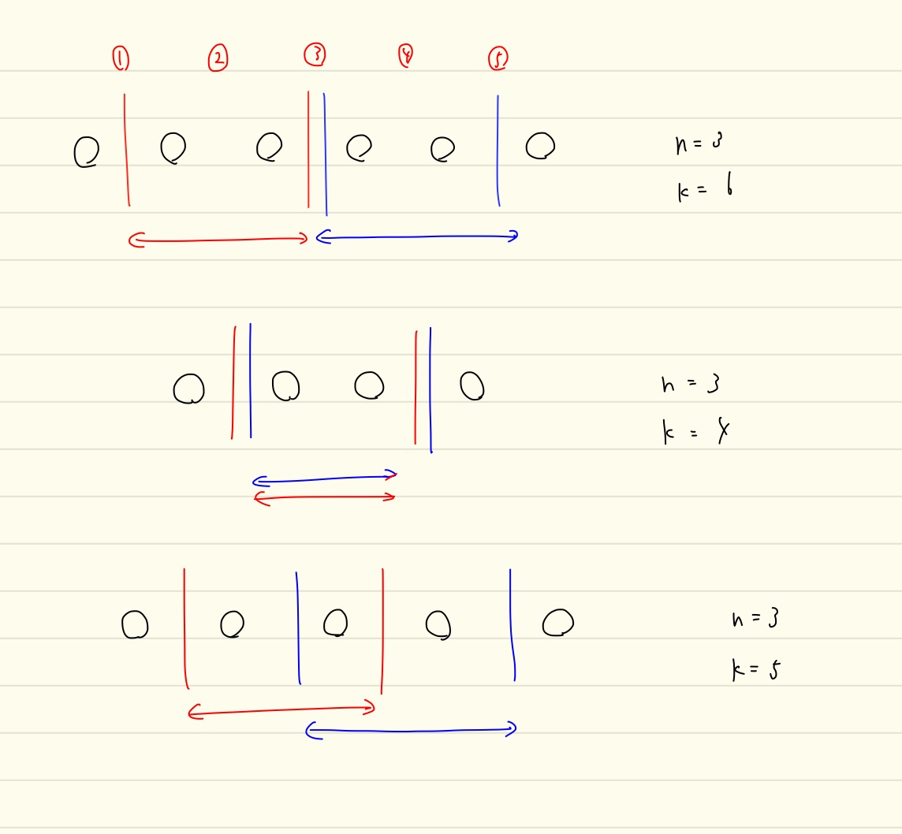

# ARC107 感想

Bの数え上げパートで破滅してしまった。  
Cはスムーズだったんだが。。

## A問題

ちょっとびっくりしたが、1つの文字に注目したらほかは定数と扱えるので、展開するのは容易。

## B問題

発想はあっていたが、「ある数Aを1以上N以下の2つの数に分割する方法の通り数」を求めるパートで破滅してしまった。

自分は重複組合せに帰着してから、間違いがあった部分を排除しながら最終的に正しい答えに行き着くことが出来た。  
一方で、回答PDFで言われているような式はどうやって立式するのか気になる。。

## C問題

こっちのほうがよっぽど簡単だと感じた。  
DSUを使って適当に。

### 知識

> 整数 `N, K` が与えられます。2つの整数の組 `(a, b)` であって `1 <= a, b <= N かつ a+b = K` を満たすものの
> 個数 `f(N, K)` を求めてください。

これは `K = 2, 3, .., 2*N` の範囲であれば `f(N, K) = min(k-1, 2 * N + 1 - K)` で求まるらしい。  
知識としてしまってもいいかもしれないが、自分は今回は画像のようにして区間の長さを考えた。  
とはいえ、「2つのサイコロの目の和の分布」と言われると、そこから考えを進めなかった自分が悪い気がしてくるので、
そこに注目したい。

## D問題

面白そうなDPだったので考えたかった。  
分割数の考え方が使えそうで、学ぶ価値が高そう。

