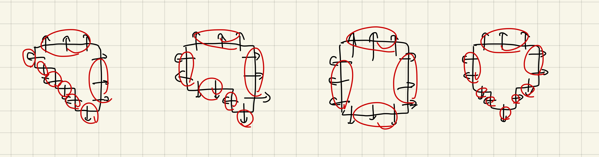

# ABC191 感想

C, Dが難問すぎて提出できず。
やっぱり当分はNoSubを続けたほうが精神衛生的に良さそう。

## A問題

ちょっと難しいが、消える幅を計算すれば条件の立式は確信を持ちやすい。

## B問題

ただのプログラミング、Aより簡単。

## C問題

問題文が最悪すぎる。
コンテスト後の運営陣の発言を見る限り「この程度の複雑さは今後も出題されますよ」というふうに読めたので、
やはりEまで解けないと提出したくない。

画像みたいな感じで法線をまとめるようにして解いた。

## D問題

こちらはシンプルに難しい。
できるだけ整数に閉じる範囲でやりたいが、10000倍する、という発想になかなか至りづらい気がする。

## E問題

めちゃくちゃ簡単。
全部の頂点を始点にしてダイクストラすれば、あとはひと工夫するだけ。

## F問題

面白そうだったので、こちらを考えるべきだったかもしれない。

