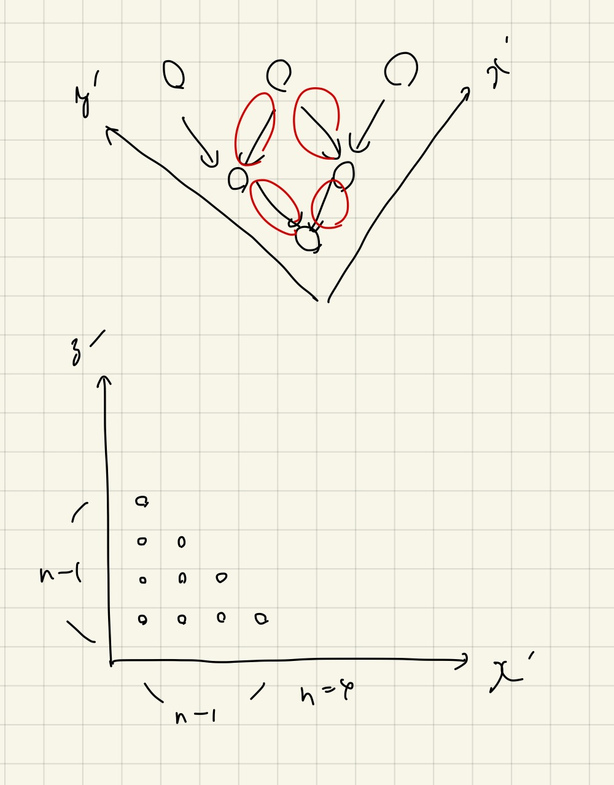

# AGC難易度順埋め

Last Change: 2020-12-03 00:33:04.

AGCはなんとなく毛色が違うので分けてみる。

## [AGC046-B ★](https://atcoder.jp/contests/agc046/tasks/agc046_b) @2020-07-18

自力で通ったが。。

数え上げは重複なく足し上げるのがセオリーだと思うが、重複を数えてから引く方針で適当にやったら通ってしまった。

PDFでは「上の行に複数の黒マスが存在するかどうか」というのをフラグに持たせた `dp[h][w][flag(0 or 1)]` という
3次元のDPを考えていた。

こちらのバージョンでいずれ解き直したい。

## [AGC009-B](https://atcoder.jp/contests/agc009/tasks/agc009_b) @2020-07-19

自力AC。

木DPになるっぽい。とはいえメモ化とかは不要（なはず）。
PDFとは木の組み方が逆な気がするが、結局は同じことを考えていると思う。

木DPの際に自身の子たちについてソートしても計算量的にOK、というのは、
全方位木DPを勉強して身についた気がする。

## [AGC040-B ★★](https://atcoder.jp/contests/agc040/tasks/agc040_b) @2020-07-19

解説（放送）AC。
なんとなくPDFでもわかったけど、思考の流れを学ぶために放送も見る。

- 右端が一番左にある区間に注目する。
  - それが属するコンテストでは、右端が固定される。
  - 同様に、左端が一番右にある区間にも注目する。
- これらが「同じグループ」か「別のグループ」かを考える。
  - 同じグループのときはかんたん、一番長いものだけを別グループに1つ割り当ててやるだけで良い。
- 例えば、「右端が最小」のグループでは、他に追加する区間について右端を気にする必要はない！！
  - 右端は最初に割り当てたリーダーで確定する、左端だけに気をつける。

**典型: 区間の共通部分は `(maxL, minR)` によって決まっていく**

↑のような操作を深く考える問題として良問だとは思うが、最後の答えを求める詰めの部分が、個人的には直感的ではなく難しい。。

## [AGC025-B ★](https://atcoder.jp/contests/agc025/tasks/agc025_b) @2020-07-19

解説AC。これは本番で参加していて解けなったらものすごく悔しかったと思う。

緑色であるブロックを塗る、というのは「青色でも赤色でも塗る」という操作に言い換えると、
恐ろしく問題がかんたんになる。

緑の個数を固定して全探索するのかと思ったが、それだと `O(N^2)` になってしまってわからなかった。
言い換え一つでこんなに計算量が減ってしまうとは。。

特殊な知識やテクニックは一切使っていないが、「重ねて塗る、選ぶ」みたいな言い換えは今後も有り得そうなので、
経験値として覚えておきたい。

## [AGC026-B ★★★](https://atcoder.jp/contests/agc026/tasks/agc026_b) @2020-07-19

解説（放送）AC。こどふぉっぽい算数だが、自分がこれまで解いてきたものよりもはるかに難しい。

[けんちょんさんの解説](https://drken1215.hatenablog.com/entry/2018/07/18/083000)がおそらく一番やさしいが、
それでも拡張ユークリッドの互除法について理解できないと
「 `個数 mod B` の最大値を求める部分」がなぜそう求まるのか？が理解できない（なぜいきなり最大公約数が登場する？）。

逆に言うと、拡張ユークリッドの互除法を理解するのに良い機会になるかもしれないので、ちゃんと復習したい。

[kmjpさんの解説](https://kmjp.hatenablog.jp/entry/2018/07/16/1000)のほうがわかりやすいかもしれない。
ただ、「 `mod B` の世界で `D * x` の増え方が `gcd(D, B)` の倍数になる」という部分がやはりスッキリしないので、
剰余算と重点的にGCDについて復習する必要がある。

## [AGC033-C ★](https://atcoder.jp/contests/agc033/tasks/agc033_c) @2020-07-21

解説AC。なんかわかる気がしなかった。
誤読して、コインがないところも選べると考えてしまったのは非常に良くなかった。

なんとも見方を変えるとシンプルな問題になる。
注目すべき量は「木の直径」だけで、選べる頂点が直径の端点の場合は直径が1減少し、
そうでない場合は2減少する。

後は1つの山から1回で1個もしくは2個取れる石取りゲームになり、
これは数が少ないところからDPすればよい。

## [AGC036-B ★★★](https://atcoder.jp/contests/agc036/tasks/agc036_b) @2020-07-23

解説AC。最後の単純なシミュレーションで勘違いをしており、なかなか通せなかった。

ダブリングの応用問題として、実装の練習に良い。

すべての位置について、次はどれだけ移動することになるか？という距離を `next[0][v]` として求めておく。
すると、 `nid := (v + next[0][v]) % n` という感じでMODによって求まる。

詰めるべき距離は `n*k - 1` なので、ギリギリまでこれを減らしていけばよい。
`n` 未満まで減らすことができれば、あとは愚直にシミュレーションしてやればよい。
**計算量をちゃんと見積もって、許される限り単純な実装を心がけること！**

## [AGC026-C ★★](https://atcoder.jp/contests/agc026/tasks/agc026_c) @2020-07-23

解説（放送）AC。思いつける気がしない。。

文字列を半分にぶった切ると、例えば前半で赤が `x` 文字だとすると、必ず青は `n-x` 文字となる。
すると明らかに、後半では赤が `n-x` 文字で青は `x` 文字である必要がある。

このときに、前半を左から赤を読み次に折り返して右から青を読んだものと、
後半についてはまるっきり対照的に読んだものがおなじになっていれば良い。

これらを `(string, string)` というタプルをキーにしたハッシュマップに前半・後半で数をもたせておけば、
キーが一致するもののバリューの掛け算をすべて足し合わせることで、答えが求まる（定数倍が重めだが、TLも3secと余裕がある）。

思いつくためにヒントは、以下のあたり。。？

- 半分全列挙的なノリで `2^n` を軸に考える（これは当然やった）
- **文字列を半分に切って固定してみる（汎化性能のある手法かは不明）**

## [AGC013-B ★★](https://atcoder.jp/contests/agc013/tasks/agc013_b) @2020-07-24

解説AC。

まず辺を適当に選んで、それらの端点が条件を満たしているかどうかを調べる。
満たしていなかったら、まだパスに組み込んでいない隣接ノードを新たに端点に変更してやる。
これを無限ループ2回で、片方の端点ずつ決定してやれば良い。

グラフのパスの構築方法として覚えてはおきたいが、どれくらい汎用性があるかは微妙。。

## [AGC008-C ★](https://atcoder.jp/contests/agc008/tasks/agc008_c) @2020-07-24

解説AC。大分かんたんな方だとは思うが。。

s, t, zを使わなくて良いことにもっと早く納得したかった。
ここで余計なエネルギーを使った気がする。

特殊な組み方として、i, j, lで `k += 3` とできるわけだが、これは使うとしたらたかだか1組だけ、
というのが最も重要。
よって、それぞれが1つ以上ある場合はこのパーツを使う選択肢が存在するので、
「1つも作らない場合」と「1つだけ作る場合」の両方を考慮して、あとは貪欲に組んでいく。

こどふぉのDiv2-Dぐらいの1800点ぐらいのパズルでありそうに見えた。

## [AGC043 B.123 Triangle](https://atcoder.jp/contests/agc043/tasks/agc043_b) @2020-12-03

発想重視の問題？難しかったが、解説放送を聞いたらなるほどと思った。  
以下のように考えを進める。

- 1段目は全部 `-1` しても答えは変わらない、これは2段目で `-1` の影響が全て相殺するため。
  - この発想は「2段目以降は0, 1, 2しかない」ということに気づくことができれば、なんとかできそう。
- 「答えの偶奇性を判定することはできないか？」と考える。
  - これは、「最初の段の1について、それが最後の段の計算になるまでに何回寄与するか？」ということを考えれば良い。
  - 「2数の差の絶対値の偶奇性」を考える分には、「2数のXORの偶奇性」を考えてもよく、そのように考えると競プロで一つの独立した問題になりそう。
    - 愚直 `O(N^2)` をどうやって計算量を落とすか？みたいな問題。
  - コレ自体も結構難しいと思うが。。
- 偶奇性は判定できたので、残りは0, 2に絞られる。
- ここで「1が1つでも含まれていたら、2は絶対にありえない」というものがある。
  - これは、ここまで詰める前の段階でうっすら気づく話かもしれない。
  - 簡易的な証明は帰納法っぽいやり方で行ける。
    - すべて1ならば、次に全て0になって終了。
    - そうでない場合は、1の隣に必ず2,0のものが存在するので、次の段でそのような隣接部分は1になってしまう。
  - これにより、「1が一つでも存在すれば0で確定」となる。
- ここまで来ると「0, 2のみで構成される列について同じ問題を解く」ということになるが、
これは全ての数字を2で割ってしまえば、答えが0, 1のシンプルな問題になる。
  - この答えを最後に2倍してやれば、求めたいものが確定する。

各奇数の寄与回数 `C(n-1, i)` については以下の画像のように、パスカルの三角形的なものの、
奇数が通る経路数から考えることができる。

