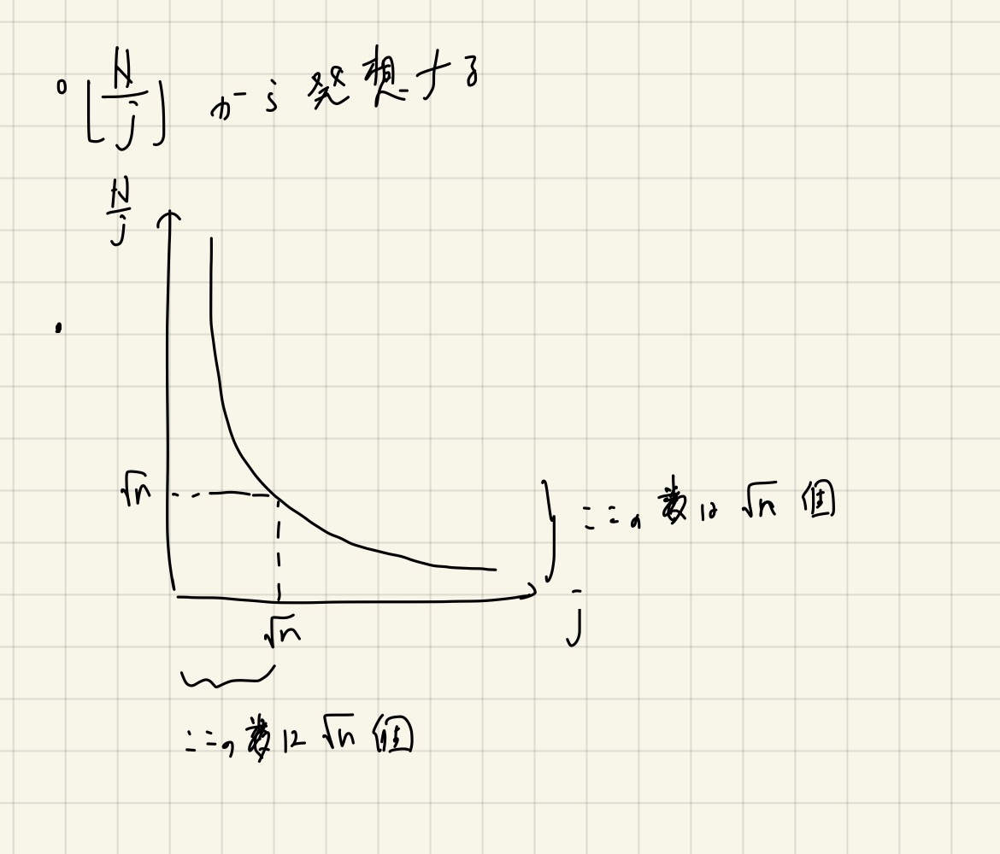

# difficulty順に埋める

Last Change: 2021-01-26 23:54:06.

@2020-06-29より、埋めていないところから順に埋めていく。
おそらくは復習が必要な問題が並ぶはずなので、最初から集めておく。

## [ABC161 F.Division or Subtraction ★](https://atcoder.jp/contests/abc161/tasks/abc161_f) @2020-06-29

こどふぉならmath, number theoryタグがついてdiff 1600ぐらいになりそうな問題。
でもわからずに解説AC。

剰余の推移に目をつけたのは良かったが、逆から考えようとした時点で間違いだった。

ていうか誤読してた、死にたい。

## [ABC030 D.へんてこ辞書](https://atcoder.jp/contests/abc030/tasks/abc030_d) @2020-06-30

[ABC167-D](https://atcoder.jp/contests/abc167/tasks/abc167_d)とほぼ同じな気がする。

バカでかい `k` の対処は桁DPなどでよくある剰余の扱いをすればよいが、違いはそこだけだと思う。

これもダブリングをするとライブラリ貼るだけとかにできるのかもしれないが、
ライブラリチェックはよりシンプルな問題の方だけで試せば良い気がする。

## [AGC044 A.Pay to Win ★](https://atcoder.jp/contests/agc044/tasks/agc044_a) @2020-06-30

難しい。答えを効いても計算量見積もりが非常に難しい。
すぬけさんの解説放送でのざっくりとした見積もりが一番わかり易い気がする。

とりあえずは「ハッシュマップを使ったメモ化再帰」というのがこの問題で一番手にしておきたい経験値だと思う。

## [ABC025 C.双子とoxゲーム ★★](https://atcoder.jp/contests/abc025/tasks/abc025_c) @2020-07-01

答えを見たが面白かった。ゲーム木の基本問題として覚えておきたい。

ゲーム木の考え方（再帰部分）もそうだが、
「ゲームにおいて最大化と最小化を考える2プレイヤーがいるとき、総和が一定であることに注目すると見通しが良くなる」
という部分は応用の幅が広そうであるため、ぜひ覚えておきたい。

## [ABC013 D.阿弥陀](https://atcoder.jp/contests/abc013/tasks/abc013_4) @2020-07-01

自力。ダブリングの練習ができた。

ダブリングのコードは[けんちょんさんのブログ](https://drken1215.hatenablog.com/entry/2020/06/20/190700)
がわかりやすかったので、変数名なども含めて写経した感じになった。

## [ARC023 C.タコヤ木](https://atcoder.jp/contests/arc023/tasks/arc023_3) @2020-07-02

自力。

逆元が一般的でなかった時代の過去のもの。
注意点としては、制約が最近では見ない感じで、もろもろを前計算する自前の組み合わせライブラリではうまく行かず、
コンビネーションを愚直に計算しないと駄目なタイプだった。

## [ABC011 D.大ジャンプ ★](https://atcoder.jp/contests/abc011/tasks/abc011_4) @2020-07-02

解説AC。

場合の数なら簡単だが、確率を求めろとなると場合の数を考えると失敗してしまう。

パスカルの三角形を応用すると、 `C(n, r), r = 0, 1, .., n` までのすべての組み合わせの確率が直接求まる。
この事実をうまく利用すると、所望の確率が計算できる。

ポイントは、一度場合の数の考え方をリセットして忘れて、 `C(n, r)` に閉じた積事象の確率で考えること。

`O(N^2)` で任意の確率が求まる可能性があることについては覚えておきたい（これから出題される可能性は低そうだが）。

## [ABC023 D.射撃王](https://atcoder.jp/contests/abc023/tasks/abc023_d) @2020-07-03

自力。

最大値の最小化といえば二分探索がまっさきに思いつくので、そこを狙って考えれば簡単だと思う。

判定関数の中でソート処理が含まれるので計算量にはlogが2つつくことになるが、
制限時間が5秒なので大抵の言語で余裕だと思う。
Goだと1100msecぐらいだった。

## [ABC014 D.閉路](https://atcoder.jp/contests/abc014/tasks/abc014_4) @2020-07-04

自力。

木のLCAを求めて、与えられたノード2つの根からの深さとLCAの根からの深さを用いて計算してやる。
LCAの利用問題としては最易の部類だと思う（ので、verify用問題として良さそう）。

※LCAはフルスクラッチで書ける必要はないが、アルゴリズムの動作原理や内部で保持しているデータ構造（ `depth` ）については理解しておくべきだと思う。

## [ABC162 F.Select Half ★★](https://atcoder.jp/contests/abc162/tasks/abc162_f) @2020-07-04

解説放送AC。

解説PDFだけだと理解がきつい。
解説放送ではDPの組み方まで教えてくれたのでわかりやすかった。

制約が厳しいことから状況を整理して、最終的にやるべきDPを見出したい。

## [ABC171 F.Strivore ★★](https://atcoder.jp/contests/abc171/tasks/abc171_f) @2020-07-05

解説放送AC。

これもPDFだけだと理解がきつい。

独立？な数え上げをうまくやる方法として「最終的なものが部分列として含まなければ行けない」という点から出発している（多分）。
発想がとても賢い。。

最終的には、組み合わせライブラリを用いるシンプルな数え上げになる。

- 操作手順を考えると重複が出てきてわけがわからない。
- **挿入後に出来上がる文字列が「どういう性質を持つか？」から考える。**
- ある文字列が部分列を含むか？の判定はシンプルに前からみる貪欲法で良い。

## [ABC154 F.Many Many Paths ★★](https://atcoder.jp/contests/abc154/tasks/abc154_f) @2020-07-05

解説（放送）AC。

まず、2次元累積和的な発想が求められる。
これにより、原点中心の「量」が高速に求められればOKというシンプルな問題になる。

※実際に小さい範囲でマス目を書いて、通り数を埋める実験をやるべき！

※すぬけさんの解説放送の方法はパスカルの三角形の理解が深まるので、これはこれで面白い。
（というより「組み合わせ」という量の性質が色々見つかって面白い。）

**※今までパスカルの三角形は「貰うDP」っぽく考えていたが、すぬけさんの解説のように「配るDP」の視点も持てると、色々と応用幅が出そうな気がした。**

## [ABC165 F.LIS on Tree](https://atcoder.jp/contests/abc165/tasks/abc165_f) @2020-07-05

久しぶりに自力で解けるABC-Fが出てきた。

「DPの巻き戻し」と呼ばれるテクニックを使うらしい（復元とは全くの別物っぽい？）。

何やらstackを使うと良いらしいとあるが、自分はLISのデータ構造をスライスのスライスとして持って、
最後尾の該当するものを都度削除するという方法をとったらうまくいった。

※同じ値の要素が存在するLISは少し注意が必要！（1回WAしてしまったので）

## [ABC159 F.Knapsack for All Segments ★★](https://atcoder.jp/contests/abc159/tasks/abc159_f) @2020-07-05

解説AC。

耳DPが難しい。。
絶対に復習が必要となる問題。

※解説放送を見ればわかるが、部分和問題の数え上げ問題は、多項式の係数と深い関わりがある。
割り算だったり順序を入れ替えたり、とかの正当性がすっきりわかるので、数え上げ手段としては強力（っぽい）。
実装も多項式バージョンを紹介しているっぽいので、気になったときにチェックして写経してみるといいかもしれない。

※いつも頼りになる[けんちょんさんの解説ブログ](https://drken1215.hatenablog.com/entry/2020/03/22/224200)

## [ABC173 E.Multiplication 4 ★](https://atcoder.jp/contests/abc173/tasks/abc173_e) @2020-07-06

コンテスト中に解けなかった問題。注意力要素も強めな気がする。

解説放送で勉強する。

- 適当にやると場合分けがやばいので、丁寧にやりましょう。
- 0は一旦無視する。
- 「積を正にできるか⇔負を偶数個選べるか」←これが結構難しい。
  - 「正が1つでもあるかどうか」という視点は重要（最後の1つで帳尻合わせできる）
    - 実際、「負の数をk個選んだらどうなるか」を考えると、帳尻合わせが簡単に出来る（正は1つかならず残るので）。

## [ABC173 F.Intervals on Tree ★★](https://atcoder.jp/contests/abc173/tasks/abc173_f) @2020-07-06

解説放送AC。簡単とか言われてたが、PDFを読んだ感じ初めて出会う考察だったように見える。

- 連結成分数を言い換える
  - `頂点数 - 辺数`
    - **これは「木の頂点数と辺数の関係を森の各木に対して適用してやる」ことで知らなくても発想できる！**
  - サイクルが起き得ない木グラフだからこそできる言い換え
- 辺数を数えるときは「横から見るものを縦から見る」やつで数える
  - 「主客転倒」とか「寄与ゲー」とかも言われるらしい（個人的に前者の言い回しが好き）

## [ARC014 D.grepマスター](https://atcoder.jp/contests/arc014/tasks/arc014_4) @2020-07-07

自力。易しめではあるものの、ノーミスで通せたのは嬉しい。

マージされる行間に注目すると良い。
マージされるものが増えていくと、その分 `x+y+1` を考えるべき個数が減っていく
（ちょうど↑の問題で、森に閉路とならないように辺を足すと連結成分が1つずつ減っていくように）。
その代わりにマージされた間の長さを加算すれば良いことになる。

これらの計算は行間のdiffを集めた配列を照準ソートして、
二分探索によってマージする個数が、prefix sumによって加算すべき値（寄与させる値）がわかる。

端っこの処理に注意。

## [ABC131 F.Must Be Rectangular! ★★](https://atcoder.jp/contests/abc131/tasks/abc131_f) @2020-07-07

解説放送AC。PDFだけでは考察の流れ（気持ち）がわからなかった。

- 2次元の点を軸に射影するのは典型？[多分そう。](https://drken1215.hatenablog.com/entry/2019/06/23/004700)
  - 点を辺だと考える。2部グラフ上の点。
  - **完全二部グラフになるまで辺を追加する。**

**典型: 格子点を二部グラフとして考える。**

「二部グラフの奇数長のパス」というのも既視感があるので、発想の種として覚えておきたい。

実装は割と簡単かも（ちょっと考えたものが解説のすぬけさんのものとほぼ同等だったのは自分を誉めたい）。
連結成分でちょっと複雑なことをしたいときは、アドホックにDFSを書いたほうが融通がききそう。
（ABCの序盤ではunion findで雑にやるのも検討したい。）

## [ABC142 F.Pure ★★](https://atcoder.jp/contests/abc142/tasks/abc142_f)

解説放送AC。

なんとなくやりたいことはわかっても実装方法がよくわからない問題だった。
ので、最初から解説を参照した。

閉路ができたら必ずOKなものが存在する。
閉路があって条件を満たさない場合、その中に余計な辺があることになるが、
それを利用してより小さい閉路ができる。
よって、再帰的に調べていけば、いずれ条件を満たす閉路が見つかる。

↑多分、この考察が一番配点の大きい部分だと思う。
実装は割と適当でもいい、はずだがよくわからなかった。

また、言い換えるとBFSで最小（極小）サイズのサイクルを見つける、というのでよい。

BFS, DFS両方の実装をやってみたい。
が、BFSのほうが大分素直に見えるし、BFSにもっと慣れたいこともあるので、まずはここを強く覚えるのが良いかもしれない。

。。この問題などを見ると、ABC-Fは意外とシンプルに考えて良いものが多いのかもしれない。

**典型: BFS, DFSで有向グラフの閉路を取得する実装。**

※DFSの実装は[毎度おなじみのけんちょんさんのブログ](https://drken1215.hatenablog.com/entry/2019/09/29/012000)が大いに参考になりそう。

## [ARC031 C.積み木 ★★](https://atcoder.jp/contests/arc031/tasks/arc031_3) @2020-07-10

解説AC。簡単だと思ったが、多分どこかに間違いがあり、サンプルを除いて全然テストをパスしていなかった。

転倒数っぽいからBITを使う発想はすぐに出てきたが、転倒数の発想のママでは解けなかった。
てっきり累積和的なものを使って、最大のものをどこに置くかを全探索するものだと思ったが。。

正解は、その時点で最も小さいものを左右の端どちらかに寄せる必要があるが、どちらでも問題ないので近い方に寄せる貪欲を繰り返す、というものだった。
「小さいものから処理していく」というのは典型発想だったので、これも考えたかった。

この手法は、BITを使うことによって実装できるが、BITの扱い自体もあまり慣れていないので、いい練習問題として覚えておきたい。

**典型: 小さいものから処理していく。**

※転倒数を考えて全探索する方法もあまり間違いっぽくはない気がするので、どこかで解き直してみても良いかもしれない。

## [ARC051 C.掛け算 ★](https://atcoder.jp/contests/arc051/tasks/arc051_c) @2020-07-10

解説AC。というか、公式PDFを読んでもよくわからなかったので、色々なブログ解説を読んだ。
が、それでも最初はよくわからなかった。

よーく考えたら簡単な話だった。

「最小値にAをかけたものが、直前の状態の最大値以上になったら、以降は周期性を伴って変化する」というのは簡単な話だった。
最初、なぜそうなるのか理解できなかったが、具体的に昇順に並べた数列に対して、例えば2でもかけたものを書いてみると良い。

`A[n] <= A[1]*2` となったら、当然次は `A[1]*2 <= A[2]*2` となる。
これが繰り返されるのだから、周期性に疑問を抱く必要はない。

よって、最大値を超えるまではシミュレーションして、それ以降は周期性を利用して、二分累乗法によって計算を進めれば良い。
最初のシミュレーションについて注意が必要そうに見えるかが、結果は `int64` に収まるのと、
最大値を超えるまでに必要な掛け算の数はせいぜい30回もあれば十分なのはすぐわかる。
よって、そんなに悩む必要はない。

## [CODE FESTIVAL 2014 予選A D.壊れた電卓 ★★](https://atcoder.jp/contests/code-festival-2014-quala/tasks/code_festival_qualA_d) @2020-07-11

解説AC。実装でコーナーに気づけず、地獄を見た。

桁DP的な考え方で数を捉える必要がある。
すなわち、貪欲的に左の桁をあわせたいわけだが、どこかでずらさざるを得ない時が来る。
これ以降は、大きくしてしまったなら選べる選択肢の中で最小を目指し続けるし、
小さくなってしまったら選べる選択肢の中で最大を目指し続ける必要がある。

よって、元の数字を左からいくつコピーするか、次の桁はどの数字にするか（ずらすか）、以降の桁はどの数字を連続させるか、
を全探索すれば良い。

おそらく、leading zeroをちゃんと扱わないと最小値を見逃してしまうテストケースが2つ存在する（具体的にどのようなものかは調べていないが）。
[この方の記事](https://qiita.com/ophhdn/items/339133a31b9e33c8c264)で気づけた。
「なんで戦闘のものだけ除けば十分なのだろう？」と思ったが、2つ0が続くようなものは最適にはなりえないため（多分）。
。。一回整数に変換してからまたOK判定するほうが賢かったかもしれない。。

その他、計算量は大分余裕があるので、イミュータブルなコーディングを心がけるのも大事。

※bitDPと桁DPをあわせたようなDPでも解けるようなので、いつか練習してみても良いかもしれない。

## [Indeedなう予選A D.パズル ★★](https://atcoder.jp/contests/indeednow-quala/tasks/indeednow_2015_quala_4) @2020-07-11

解説AC。実装が大変だが面白かった。

半分全列挙の考え方。
すなわち、 `3^24` は探索できないけど、 `3^12` ならOKなことを利用する。

初期状態から12階層、ゴール状態から12階層探索する。
盤面をハッシュ化することでハッシュマップに載せられるため、初期状態あるいはゴール状態からその盤面に至る最短手数を求めておく。
最後に、初期状態から到達可能な盤面とゴール状態から到達可能な盤面で一致するものを調べ、
最短手数を更新していけば良い。

**複雑なものでも、一致判定ではハッシュ化、あるいはソートをすぐさま検討できるようにしたい。**

※DFSの場合は途中で更新が起きうる場合があることに注意！その意味ではBFSのほうが高速な気がする。

※Aスターアルゴリズムでも解けるっぽい。kenkooooさんがブログを上げていた。

## [ABC167 F.Bracket Sequencing ★](https://atcoder.jp/contests/abc167/tasks/abc167_f) @2020-07-11

解説（放送）AC。

貪欲を詰めていくのが難しいと思う。
とはいえ、特別なアルゴリズムは用いない。

すぬけさん曰く、「アドホックな問題」。

- **カッコ列は折れ線グラフで考えると良い。**
  - **正しいカッコ列であるための条件は「0で終わる、0未満にならない」となる。**
- 断片を2つの値で表す。
  - ここはいろいろな見方ができそう。
  - 最下点と最終的な増加量を調べる。
    - 一度下がって一度上がる、シンプルなV字のものに統一できる。
- 増加量の正負でわけると、理想的な高さまで上がり下がりする、という考え方のもとでは、並べ方をシンプルにできる。
  - 上がるときは、最下点が大きいものからつなげるのが良い。
    - くっつけやすいものからくっつけていることになるので、それが無理ならどうあがいても無理。
  - 下がるときは難しい。逆から考えると同じ話になっていることに着目しないといけない。

## [ABC152 F.Tree and Constraints ★★★](https://atcoder.jp/contests/abc152/tasks/abc152_f) @2020-07-11

解説（放送）AC。これも包除原理だった。

余事象っぽく考えれば良いのでは？と思ったが、あまりにもシンプルに考えすぎた。

包除原理を真面目に計算するタイプの問題に初めて出会えたので良かった。
**包除原理は、余事象を考慮するときに一緒に考えておくと良さそう。**

- 包除原理は、一般的には2のべき乗の計算量になる。

※すぬけさんの放送でやっていた実装では、パスを求めるのにDFSを行って、
「ゴールを引数に入れてそこに到達したらそこから巻き戻してパスを逆順にスライスに突っ込む」
というのが賢かった（ゴールとは違う終点にたどり着いたら `false` を返すことで無視できる）。
パスのスライスは、グローバルにおいてDFSを大元で呼ぶ前に初期化すれば良い。
シグネチャは `func dfs(cid, gid, pid int) bool` という感じ。

※包除原理の辺の数を数えるところは一貫してビット演算に閉じると、ビットマスクのOR演算で収まったり、大分高速になりそう。

※LCAを使った「木上の累積和」というのは結局謎のままだった。

## [CODE FESTIVAL 2014 Easy D.枕決め ★★](https://atcoder.jp/contests/code-festival-2014-morning-easy/tasks/code_festival_morning_easy_d) @2020-07-12

非公式の解説ブログを読んでAC。

貪欲の考え方は合っていたが、実装に嘘が含まれていた。

多分、priority queueをうまく使うしかない。

**典型: 貪欲法にはpriority queueが相性が良い。**

- [mayokoさんのブログ](http://mayokoex.hatenablog.com/entry/2015/10/08/210337)
- [kmjpさんのブログ](https://kmjp.hatenablog.jp/entry/2014/11/10/1030)

多分、どちらも同じことをやっていると思われるが、mayokoさんのブログのほうがわかりやすかった。

まず、「枕を小さい順に見るとき、その枕に適合する人の中で、最も右端が小さい人に割り当てるのが最適」といえる。
これは、残った以降の枕は今見ているものよりも高いので、より割り当てる人が多く存在させることができ有利だから、
というので直感的な証明になる（。。と思う）。

自分は最初、区間スケジューリングの要領でソート後は線形な探索をしてしまったが、
ここで捨てては行けないものを捨ててしまっていた。
すなわち、今見ている枕に適合しないものを捨ててしまって、後で再びみることがないようなコードになっていたが、
たとえば、 `(25, 41)` という人は `12` の枕には適合しないが、あとから来る `35` には適合する。
一方で、自分が書いた嘘コードでは、 `12` に適合しない時点で捨ててしまっている。

そこで、小さい順に枕を検査する部分は変えずに、「今見ている枕については左端の条件が全て満たされているような人集合」
を保存しながらすすめる方法を考える。

このためには、まず人スライスを左端で昇順ソートすれば良い。
一方、人を対象とするpriority queueを用意し、こちらは右端の小さいものが優先的に並ぶようにする。

アルゴリズムは、今観ている枕よりも左端が小さい人をすべてqueueに詰めていく。
詰めるフェーズが終わったら、queueから右端が小さいものを順に取り出し、
適合するものが見つかったら（それが最も選べる人集合の中で最適なので）それを選んで次の枕に進む。

## [ARC075 E.Meaningful Mean](https://atcoder.jp/contests/arc075/tasks/arc075_c) @2020-07-12

自力、というかもはや超有名問題。

変数分離をすると、よくあるzero sum rangesのテクニックが使える数え上げ問題になる。

累積和を使ったりした後は、「すでに見たものの中で、現在注目している値以下のものの個数は？」というのを
都度数え上げる問題になる。
模範解答でもそうだったが（evimaさんいわく「最もかんたんと思われる手法」）、
座標圧縮してからBITによる各要素の個数管理を用いるものを利用して、実装した。

多分treapなどのordered setでもできると思うが、普段の使用頻度が小さいものを練習してみた。

## [ARC026 C.蛍光灯](https://atcoder.jp/contests/arc026/tasks/arc026_3) @2020-07-12

自力。以前にも似たようなものを解いたことがあったためできた。とはいえ時間かかりすぎ。。

まずは、貪欲的な発想の元、左端の昇順ソートを行う（もれなく廊下を照らす必要があるため）。

`dp[i] := iまで照らされている場合の費用の最小値` とすれば、RMQのセグメントツリーと合わせて解ける。
更新は `dp[l] ~ dp[r-1]` までの最小値がわかれば、それプラス現在観ている蛍光灯のコストとの和をみて、
更新すべきかどうかの判断ができる。

## [ARC029 C.高橋君と国家](https://atcoder.jp/contests/arc029/tasks/arc029_3) @2020-07-14

自力。こどふぉでほぼ同じ問題を解いたことが合った。

交易所を作る、というのを架空の都市との間に同じコストでエッジを張る、という操作とみなすと、
エッジ数のオーダーが変わらない範囲でエッジ数が増えた上での、単なる最小全域木を求める問題になる。

## [ABC170 F.Pond Skater ★★★★](https://atcoder.jp/contests/abc170/tasks/abc170_f) @2020-07-14

解説放送AC。

グラフ拡張＋順序が定義できる構造体をpriority queueに詰めるダイクストラで解ける（TLギリギリだったが）。

`dp[i][j][d] := (i, j) における方向 d を向いている時の状態` とし、状態を「水かき回数、残りの推進力」で表す。
すぬけさんの実装による `(i, j, d) => id` という変換やその逆操作を行う関数など、非常に勉強になった。

順序が定義できる構造体のダイクストラや、3次元の複雑なグリッドグラフの変換など、練習できる要素が多い。

## [ABC151 F.Enclose All ★](https://atcoder.jp/contests/abc151/tasks/abc151_f) @2020-07-14

最初から解説放送を観た。

最小包含円。

**「円は3つの点によって定まる（外接円）」**
他に点は乗っていることもあるが、気にしなくて良い。
また、2つの点が直径をなすときにも円は定まる。
これらの2つのパターンをすべて試す（すべての点が入っているかどうか判定する）。

真面目にやると計算量が大変（らしい）。具体的にはどうやって実装するか？

三分探索を行う。
関数の傾きが単調増加・減少するものについて極値が求まる？
幅が `2/3` ずつ徐々に縮まっていくイメージ。
（関数が微分できる場合は二分探索の問題に帰着させられる場合もある。）

。。正直よくわからず。解説PDFの方法がわかりやすいと思ったし、実装方法もほぼ説明されていたので、そちらでやってみた。

「N個の点が与えられる。それぞれの点を中心とし、半径が `r` の円にいずれにも含まれる点が存在するための **`r` の最小値** を求めよ。」
という問題と同値になる。
こう考えると、二分探索が適用できるようになる。

半径 `r` を決めたとき、ある2点を中心とした半径 `r` の2円の交点（2つ）は、最小包含円の中心候補となる。
（多分あってるはず。直感的には、選んだ2点を円の周上に持つ「ギリギリの円」を作ることになる。）
よって、ある決め打った `r` に対してこのような交点をすべて列挙し、
また、それらを1つずつ検査する、すなわち「中心を決めたときにすべての点が半径 `r` より内に存在するか」を判定すれば良い。
そのような中心が1つでも存在すれば `true` でありより小さな半径を調べる、そうでなければより大きな半径を調べる、とすればよい。

このとき必要となるツールは以下ぐらいの初歩的なもので、ABCレベルの幾何問題であれば常に取り出せるようにして置けると良い。

- ベクトルの加減算
- 単位ベクトルの計算
- 回転行列（ベクトルの回転）
- 中点座標の計算

※解説放送では三分探索の説明を詳しくしているので、いつか練習問題として解き直してみても良いかもしれない。

## [ABC166 F.Three Variables Game](https://atcoder.jp/contests/abc166/tasks/abc166_f) @2020-07-14

解説放送で思考の流れを学びたかった。

- 0を2箇所以上作らなければ絶対に詰まない。
- 全体にたくさん石があれば、実験とかかんたんにすればなんとなく詰まなそうというのがわかる。
- 「厳しい状況」というのを考えてみる。
- 全体の和を中心にして考えてみる。
  - （結局はここを真面目に考えるかどうかに集約される気がする。。）
- **「小さいケース（※今回の場合は、総和が小さいケース）」を考えてみる**

※実はDFSでも枝刈りが早い段階でできるらしく、一本道に毛が生えたような分岐しか起きないので、案外大丈夫、らしい。
いずれ実装してみたい。

※すぬけさんのクロージャを使う実装がとてもキレイ。

## [ARC032 C.仕事計画 ★★★](https://atcoder.jp/contests/arc032/tasks/arc032_3) @2020-07-14

解説AC。

「こういうDPもあるのか」という感じで非常に勉強になる。
一方でもう少しシンプルに書きたい気もするが、あまりいいアイデアが浮かばない。

- `dp[i] := (時刻i以降で最大可能仕事数, 最大を達成する場合の次に取るべき仕事ID)`
  - つまり、ダイクストラで時々あるような、順序が定義できる構造体（タプル）を値とするDPテーブルを定義する。
- `dp[i] <= dp[i+1]` のような遷移になるため、後ろから埋めていく。
  - あまり慣れていないので、いい練習問題としてキープしておきたい。

## [ARC045 C.エックスオア多橋君 ★★](https://atcoder.jp/contests/arc045/tasks/arc045_c) @2020-07-15

解説AC。これは解けないとだめだった。

LCAとかでよく考える「根からのコストのXOR」というのを考えておくと、2点間のそれらのXORが2点間のコストのXORに等しくなる。
なぜなら、LCAから根までの部分は二重にXORが取られることで打ち消されるから。

。。ここまではわかったが具体的な数え上げの方法がわからなかったが、実はzero sum rangesのアレで良かった。

すなわち、 `a ^ b == x` のとき `a` を固定すると `x ^ a` の個数がわかれば、 `a` とXORを取って `x` が出来上がるペアの個数がわかる。
よって、今まで見てきたもので個数を調べれば良い、ということになる。

**典型: zero sum rangesの数え上げは、左から配列をなめるだけでなくとも良い。木のDFSの順序上でも可能。**

※練習のため、 `C(n, 2)` で最後に数え上げをまとめる方法を取ってみたが、コーナーケースの処理が難しかった。
「もれなく、重複なく」の数え上げの原則を考えると、組み合わせを使うよりは逐次加算するほうが良い方法だと感じた。

## [ARC009 C.高橋君、24歳](https://atcoder.jp/contests/arc009/tasks/arc009_3) @2020-07-15

自力。ABC172-Eを解いた後だと自力で考えられた。

[完全順列、撹乱順列](https://ja.wikipedia.org/wiki/%E5%AE%8C%E5%85%A8%E9%A0%86%E5%88%97)というものの通り数が本番で、
これはモンモール数とか呼ばれるらしい。
ABC172-Eと同じく、包除原理の応用によって `O(k)` で求められる。

`N` が法外に大きいため、掛け算の前に単項に対してMODを取らないと駄目なケースがあり、1WAしてしまった。

## [ARC053 C.魔法使い高橋君 ★](https://atcoder.jp/contests/arc053/tasks/arc053_c) @2020-07-16

ABC167-Fと酷似している。
自力。。でやりたかったが嘘解法に陥ってしまったため、解説ACした。

結果がマイナスになるものは最高点が小さいものから並べるのが最適、というのはすぐわかった。
後半もフィーリングで「最高点が大きいものから並べてしまったほうが良さそう」と考えてやってみたら、
サンプルが通ったので提出した。
が、半分くらいWAの明らかな嘘解法だった。

後半ついては「降下量が大きいものから並べるのが最適」となる。
ABC167-Fと同じく、反転して考えたら対称的な問題になるため、このように考えれば良い（けど、定性的に？一瞬では納得しづらい気がする。。）。

## [ARC008 C.THE☆たこ焼き祭り2012](https://atcoder.jp/contests/arc008/tasks/arc008_3) @2020-07-16

自力。だが、色々勘違いして2WAしてしまった。

普通に人と人との間のたこ焼きの行き渡るのに必要な時間を計算し、それを辺コストとするダイクストラを考えれば良さそうと思った。。
1秒ごとにしか投げられない、という部分がなにか混乱させるが、結局中心の自分は1秒起きに `n-1` 個のたこ焼きを投げることになり、
すなわち中心の自分がボトルネックになる。
よって、自分が1秒に1回というルールさえ守れば、この部分は気にしなくて良い。

1秒間に1回の部分はシミュレーションでよく、「できるだけ遠くの人に向かって投げるように」分配するのが最適。
投げ方はシミュレーションすれば良い。

。。油断すると「最後に自分に向けて投げる」ような形となり、不必要な更新が行われる可能性があるので、この点は注意。

## [ARC025 C.ウサギとカメ](https://atcoder.jp/contests/arc025/tasks/arc025_3) @2020-07-16

自力一発！

目的地を始点とし、目的地を全探索することをベースに考える。
目的地を始点とすると、ダイクストラで各点への最短路の長さが求まる。
さらに、亀のスタート地点を目的地以外で全探索する。
あとは、亀の移動にかかる時間よりも、うさぎの移動にかかる時間が大きいようなうさぎのスタート地点の数がわかれば良い。
ここはソートしてしまえば二分探索で求められそうとわかる。

面倒な点として、目的地・亀・うさぎはすべて異なっている必要があるため、そこで違反しないように数え上げのときは注意する。
自分は、二分探索部分で面倒を起こしたくなかったので、二分探索はなるべくシンプルにして、数えてはいけないものを後から引く方針でやった。

## [ARC039 C.幼稚園児高橋君 ★★★](https://atcoder.jp/contests/arc039/tasks/arc039_c) @2020-07-17

解説AC。なんとなくこんな感じだろうな〜という予想はついたが、詳細部分はおそらく解説を見ないとわからなかった。

座標をハッシュマップで管理するのは予想通り。
重要なのは、「訪問したときに4近傍についても座標を生成してしまう」こと、
また、「訪問した箇所の4近傍は、訪問したところのポインタを参考に、移動方向のポインタの張替えを行う」こと。
このポインタの張替えは、訪問時に遅延評価的に行ってやれば良い。

実装で色々混乱してしまった。
大事なのは「訪問時には4方向について正しい遷移先が設定されている」と思い込むこと。

※Goで `map[Coord][4]Coord` のような `memo` を定義したが `memo[c0][0] = c1` のような代入はできない。
必ず `C := memo[c0]; C[0] = c1;` のように、ワンクッションおいてやる必要がある。

**※このような4近傍の情報を持つデータ構造はDancingLinksと呼ばれるらしい。**

## [Code Formula 2014 予選B D.お釣りの嫌いな高橋君 ★★★](https://atcoder.jp/contests/code-formula-2014-qualb/tasks/code_formula_2014_qualB_d) @2020-07-18

解説AC。できそうでできない。

[公式解説](https://www.slideshare.net/chokudai/code-formula2014-qualb)では、アドホックっぽい賢い解法だった。

[kmjpさんの解説](https://kmjp.hatenablog.jp/entry/2014/08/28/1000)では、DPを利用した解法だった。
こちらのほうが応用が効きそうだったので考えてみたが、ほぼ写経になってしまった。

メモ化再帰で解いている。
`dfs(d, c) := dは現在の注目桁（小さい桁から）, cはd桁で使用可能なコインの枚数` として、
十分大きな桁では1通りとなるようにしている。

。。実際に写経してみても難しく感じる。
とはいえ、DPとしては結構重要な問題だと思う。

## [Code Formula 2014 本選 D.映画の連続視聴 ★](https://atcoder.jp/contests/code-formula-2014-final/tasks/code_formula_2014_final_d)

苦しんだけどなんとか自力。

[ARC032-C](https://atcoder.jp/contests/arc032/tasks/arc032_3)に似ていた。
区間スケジューリングをDPで考えるような問題で、上のARCの問題とは別の部分をしっかりと考える必要がある。

種類ごとに連続視聴するパターンで、最適なもののみを列挙して後ろからDPというのをやった。

多分[この方の手法](https://torus711.hatenablog.com/entry/20141009/1412868963)と同じことをやっているはず。
最初、種類ごとを始点ソートしてしまい、最適な連続視聴を考慮できていなかった。
こういう勘違いを減らしたい。。

## [ARC010 C.積み上げパズル](https://atcoder.jp/contests/arc010/tasks/arc010_3) @2020-07-23

時間がかかってしまったが自力。

`dp[i][S][j] := i番目までで、今までに積んだ色の集合Sで、一番最後に積んだ色、の最大スコア` を記憶しておけば良い。
計算量は大体 `5000 * 2^10 * 10` なのでOKと判断。
実際にsubmitしたら35msecとかなり高速だった。

初期化忘れを最後までなかなか見つけられず、余計に時間をかけてしまった。
`dp[0][0][m] = 0` のように、存在しない `m` 番目（0-based）の色を使ったことで、きれいな実装にできたと思う。

状態数を工夫して減らしていくのが楽しい問題だった。
**20とか（50でもいいかも）極端に小さな数が登場したら、かならずビットマスク・冪集合を検討したい。**

## [ARC098 E.Range Minimum Queries ★★★](https://atcoder.jp/contests/arc098/tasks/arc098_c) @2020-07-23

解説AC。ただ、かなり出だしの考察が良かったので、もう少し粘るべきだった。

「小さいものからとっていくとすると、1回目で値 `a` を取ると決めると、 `a` 未満のものは選んではならなくなる。
そのような区間しか選べない場合は、中断せざるを得ない。」というようなことは考えた。

実際にはもう少し具体的にする必要があり、 `a` 以上の値の連続部分列に関しては、その長さを `m` とすると
小さい方から `m-k+1` 個は抽出できることが（よくよく図を書いたりするとかんたんに）わかる。

そこで、 `a` を決め打ったときにこのような抽出できる要素を全体から集めて、
さらにそれを昇順ソートしたときに下から `q-1` 番目を選べば、それがその時の最大値となる。

。。結構実装力が問われる問題だと思う。
区間のこのような捉え方はかなり重要だと思うので、すぐにコードに落とせるような力があると、発想力の後押しにもなると思う。

**典型: 長さ `m` の区間から長さ `k` の連続区間の選び方は `m-k+1` 通りある。**

※この問題は、例えばtourist氏の実装を参考にするなどして勉強したほうが良い。

## [天下一プログラマーコンテスト2013予選A C.天下一二三パズル ★★](https://atcoder.jp/contests/tenka1-2013-quala/tasks/tenka1_2013_qualA_c)

@2020-07-24に着手。未AC。

3を中心に考える方針はよかったが、細部の詰めが全然だった。
実験が鍵だと思う。

- [公式解説](https://tenka1.klab.jp/2013/explain/a_c.html)
- [kmjpさんのブログ解説](https://kmjp.hatenablog.jp/entry/2013/08/04/0930)
  - DFSの枝刈りでまずは部分点を取るべき。

## [天下一プログラマーコンテスト2014予選A C.天下一文字列集合 ★★★★](https://atcoder.jp/contests/tenka1-2014-quala/tasks/tenka1_2014_qualA_c) @2020-07-24

渾身の回答がガッツリ嘘解法だったので、解説AC。

- [公式解説](https://tenka1.klab.jp/2014/explain/quala_c.html)
- [kmjpさんのブログ解説](https://kmjp.hatenablog.jp/entry/2014/08/11/0900)
- [kimiyukiさんのブログ解説](https://kimiyuki.net/writeup/algo/atcoder/tenka1-2014-quala/)

kmjpさんのブログを参考にさせていただいた。

制約的にbit演算に関連した手法はもちろん想起したが、手持ちの手段が乏しくて先に進めなかった。

まず、あるパターン集合がなんらかの1つの文字列にマッチできるかどうかは、集合サイズを `n'` とすると、
`C(n', 2)` で調べられる。
これについては何回も計算するのは無駄なので、前計算して結果だけ持っておけば良い。

集合同士のまとめ上げはどうすればよいかというと、これはすべてのビットマスクの和の最適値を計算してやれば良い。
つまり、 `2^n * 2^n` をやってしまえばよい。
TLが大きめなのもあるが、 `268435456 >= 2 * 10^8` でも割と余裕で計算できてしまう（定数倍が極めて小さいからと思われる）。

**bitDPは `n` が小さいのが大きな特徴だが、その `n` が例えば18か14かなだけで取れる手段が大きく変わってくるので、**
**冷静に計算量の把握を都度行いたい！**

※↓の問題もほぼ同じbitDPの考え方が必要で、↓の制約ではもっと効率の良いことをやる必要がある！
具体的には `3^n` になるが、こちらは600msec -> 100msecとかなり高速になる。

## [天下一プログラマーコンテスト2012予選B C.席が足りない ★★★★](https://atcoder.jp/contests/tenka1-2012-qualB/tasks/tenka1_2012_7) @2020-07-25

こちらも区間スケジューリングを使った適当な嘘解法しかわからなかった。

- [kusanoさんの本問題の解説ブログ](https://kusano-prog.hatenablog.com/entry/20120818/1345260509)
- [けんちょんさんのbit記事](https://qiita.com/drken/items/7c6ff2aa4d8fce1c9361#7-%E4%B8%8E%E3%81%88%E3%82%89%E3%82%8C%E3%81%9F%E9%83%A8%E5%88%86%E9%9B%86%E5%90%88%E3%81%AE%E9%83%A8%E5%88%86%E9%9B%86%E5%90%88%E3%82%92%E5%88%97%E6%8C%99)
- [kimiyukiさんの「bit演算による集合の列挙」](https://kimiyuki.net/blog/2017/07/16/enumerate-sets-with-bit-manipulation/)

最初、kusanoさんのブログを読んでもわからずに放置していたが、一つ前の問題を解いて肝の部分がわかったので、
色々調べつつ取り組んでみた。

今回は `n=15` で、先程のkmjpさんの実装では `4^15 = 1073741824 > 10^9` となり厳しい（※あとで実験してみたら1900msecでギリギリ通ってしまった）。
そこで、無駄を削り「ある求めたいbit集合に対して、すべての分割を考慮して最適値を調べる」というのをやらないといけない。

調べると色々出てきて、かつてスルーしていたけんちょんさんのQiita記事を参照した。

この部分の計算量は `\sum_{i=0}^{n} 2^i * C(n, i) = 3^n` となるらしい（wolfram alphaを利用）。
ただし、実装がなぜそうなるか全く理解できていないので、少し調べたり考えたりしたい。

※部分集合列挙については、今回のコードで用いた降順列挙の他、昇順列挙も可能。
ただし、元の集合に対してXORをとってやれば逆順のものが得られるので、片方だけ知っていれば十分っぽい。

## [ARC091 C.LISDL ★★★](https://atcoder.jp/contests/arc091/tasks/arc091_c) @2020-07-28

実験もして自信のあった解法は全くの嘘だった。
解説AC。

基本的に公式PDFは[kmjpさんの解説](https://kmjp.hatenablog.jp/entry/2018/03/11/1100)を証明込で丁寧に
書いたものだと思うが、現実的に解くことを考えると、発想ベースのkmjpさんの解説の方が納得感が合った。

LIS/LDSの性質？を見つめ直すのには言い問題だと思うが、
そもそも適当に実装したらTLEになるし、気をつけると例外処理みたいなことに気をつけないといけないしで、
トータルめっちゃむずい。。

## [CODE FESTIVAL 2015予選B D.マスと駒と色塗り ★★★](https://atcoder.jp/contests/code-festival-2015-qualb/tasks/codefestival_2015_qualB_d) @2020-08-10

色々な解説をあたりながら、大分時間を開いたもののACできた。

[kmjpさんのブログ](https://kmjp.hatenablog.jp/entry/2015/10/25/0900)を最終的には一番参考にした。
本質的には同じことをしているんじゃないかと思う。

まずは、区間をkeyとして持つことができるように、treapを改造した（これが億劫で時間が開いてしまった）。
`less` 関数は、区間の始点を優先して定義する。

基本的には、このtreapを使ってシミュレーションを上手くすすめることになる。

1. 既存の黒色の区間がなにもないものとして、クエリ情報から区間を初期化する。
2. 作った区間の、1つ手前の区間を調べる。これと交差が発生するなら、併合した上で、1つ前の区間は消去する。
3. このようにして作った区間を起点として、以降は1つ先の区間との併合を考える。
4. 併合が必要ならば、既存の区間を消去しつつ、現在の区間をアップデートする。
5. 併合が不要になったら、答えを出力し、現在の区間をtreapにinsertして、現在のクエリ処理を終了する。

treap上の区間は、終点と始点が重ならないようにしながら管理することに注意する。

書き終わるまでは、区間の始点や終点の調整みたいな部分が面倒に感じられるが、
書いてみると案外スッキリしたコードになる。

**ちょっと大変だが、区間の交差判定の部分などは、基本の区間操作の知識が活きてくる部分で、成長を実感できる。**

## [ARC064 E.Cosmic Rays](https://atcoder.jp/contests/arc064/tasks/arc064_c) @2020-11-06

一見してわけがわからないが、ABC181-Fを解いてみるとすぐに分かる。

結局は密グラフを作って `O(N^2)` のダイクストラ法をやるだけとなる。  
priority queueを使ったダイクストラだとどうなるのか気になる。。

## [ABC022 D.Big Bang ★★](https://atcoder.jp/contests/abc022/tasks/abc022_d) @2020-11-29

全くわからなかったので答えを見た。  
この問題では「長さ」に注目するのが鍵となる。  
平行移動や回転をしても、例えば「全点対の距離の総和」といったものは不変量となっていることが重要（怪しく感じたら、相似な図形を思い描こう）。  
そして、そのような「長さ」はP倍に相似拡大されると、一緒にP倍されることになる。  

よって、そのような「長さ」の中で高速に求められるものを選ぶことが重要。  
「全点対の距離の総和」は（おそらく）どうやっても `O(N^2)` かかってしまうため、この問題では部分点しか取れない。

以下が候補となる。

- 最近点対の長さ: 分割統治法で `O(NlogN)` で求まるアルゴリズムがあるらしい。
- 最遠点対の長さ: 凸包を利用した `O(NlogN)` 解法があるらしい。
- 凸包の外周の長さ: 凸包には色々と高速なアルゴリズムがあり `O(NlogN)` で可能。
- 重心からの最遠点までの距離: これは素直なやり方で `O(N)` で可能。
- 重心からの最近点までの距離: 最遠点と異なり、距離が0になってしまうケースがあることには注意が必要、とのこと。

いい機会なので、アルゴリズムの勉強を済ませて、ライブラリ化してしまいたい。

とりあえず初回ACは「重心からの最遠点までの距離」で解いた。

## [ARC004 C.平均値太郎の憂鬱 ★★★](https://atcoder.jp/contests/arc004/tasks/arc004_3) @2020-11-29

苦手な算数の問題。  
整数系の問題だが、約数とかはあまり直接的には重要ではない問題。

「必要条件を整理すると十分条件になる」というタイプの問題だと思う、多分。  
いちばん重要なのは `n` の絞り込みの部分で、これは問題文を数式で表したときに出てくる `m/n` に着目することで、
与えられた不等式から `1/n <= m/n <= 1` という（ほぼ自明だが）重要な不等式が得られる。  
`floor(x/y) = L` が既知であることを強く意識すると `2/n + 2*L <= n <= 2*L+1` という不等式が得られ、よくよく見るとこれは、
`n = L-1, L, L+1` で候補の列挙が終わっていることになる。

あとは `m = n*(n+1)/2 - n*L/2` で表されることがわかるが、 `m` の計算には最新の注意を払う必要がある。

- まず整数の除算でむやみに切り捨てを処理してはいけない
  - 例えば最後の `m` などは `L/2` をすでに計算済みのfloor値で行うとおかしくなる
  - また `n*x/y` というのもオーバーフローを生じるためだめになる、 `n/y*x` とする必要がある
  - ↑から `m` が整数である必要があるため、 `n%y == 0` というのも必要条件になることがわかる
- `n` の範囲を多少広めにとるのは問題ないはず
  - これはちょっと怪しいかも。。
  - とはいえ、正しく計算できていれば最後の `1 <= m <= n` の条件が厳し目に弾いてくれると思う

## [ABC009 C.辞書式順序ふたたび](https://atcoder.jp/contests/abc009/tasks/abc009_3) @2020-11-29

「辞書式順序ふたたび」というなんともいかつい名前と青Diffということで後回しにしていたが、
ヒントを見せてもらえればそれほど難しくはないと思う（そのヒントがなければ難しいと思うが）。  
ヒントさえ貰えれば、こどふぉにありそうな実装問題だと思う。

解法スライドも読んだが、後半部分のマッチングの最適なやり方、の部分が考察ポイントっぽい？  
とはいえ、「辞書式順序最小→前から貪欲に」の考え方を身につけるにはいい問題なのかもしれない。

## [ARC003 C.暗闇帰り道 ★★](https://atcoder.jp/contests/arc003/tasks/arc003_3) @2020-11-29

最短経路＋二分探索という形で、非常に勉強にはなったがTLE, MLEとの戦いが苦しかった。。

愚直にダイクストラしようとすると `(time, maxi)` という超頂点を定義する必要があり、どうみても状態の数が大きすぎて困った。  
ここでは「最小値の最大化」に目を向けて二分探索を考えるべきだった。

つまり、「ある決め打った実数を達成できるか？（最小値をその実数としてゴールにいたる経路があるか？）」と考えると、
セルからセルへの遷移が可能かどうかがわかる。  
そして、「決め打った値が達成できるかどうか」という前提の上では、各セルには到達できるのが早いほどよい。  
よって、各セルで記憶すべき情報は経過時間の最小値のみとなる。

ここからダイクストラの実装を考えたが、おそらく正しいもののTLEが取れる気配がなかった。  
よくよく考えると、遷移が許されるときは必ず経過時間は等しく `+1` されるので、今回はBFSでよかった。  
これでTLEは解消されたが、今度はMLEに悩まされたので、諸々チューニングしてやっと通せた。

※ ちなみに、ゴールの到達可能性の部分を実数で判定したら、4つほど通らなかった。ここはもっと離散的に？判定できるかどうかを考えるべきだった。
※ [maspyさん](https://maspypy.com/atcoder-c-%E6%9A%97%E9%97%87%E5%B8%B0%E3%82%8A%E9%81%93%EF%BC%88arc-003%EF%BC%89)が
何やらもっと賢い方法を編み出していたので、こちらについても理解したい。

## [ARC006 D.アルファベット探し](https://atcoder.jp/contests/arc006/tasks/arc006_4) @2020-11-29

ちょっと考えたが、自力で解けた。  
今回はマス目の数のみに着目してDFSを考えた。  
拡大されるとそれぞれのアルファベットは平方数倍されるが、もとのマス目が `12, 16, 11` と区別できそうなものなので、
ここから拡大後も一意に定まらないか考える。  
それぞれを素因数分解すると `2^2*3, 2^4, 11` となり、各素因数のパリティが揃っていない。  
一方で平方数をかけると任意の素因数は偶数個しか増えないので、これらのパリティを相互に揃えることができない。  
よって、DFSで求めた黒マスの数を `12, 16, 11` の割り切れるもので割って、さらにその商が平方数であればそれぞれのアルファベットであると判定できる。

問題はDFSでは一つのテストケースで10MB弱MLEしてしまったこと。  
intからint32に変更したりしたが、大きな変化はなかった。  
面倒だったがBFSで書き直したら1/8ぐらいのメモリ使用量になって余裕で通った。  
どちらでもいいときはBFSを書いたほうがいいんだろうか、それとも最近のメモリ制約なら気にしなくてもいいだろうか。。？

[naoya_tさんのブログ](https://naoyat.hatenablog.jp/entry/ARC006_D)でchokudaiさんの解法が説明されているが、
多分自分のものも本質的には同じような気がする。

※ 「複雑に変化しない量（≒不変量？）に注目する」というのは、直前に解いていたビッグバンの問題から着想が得られていたと思う。

## [天下一プログラマーコンテスト2012予選A C.敵対的引用 ★](https://atcoder.jp/contests/tenka1-2012-qualA/tasks/tenka1_2012_qualA_3) @2020-11-29

面白い問題ではあるが、本質的でない部分で躓いて時間を取られてしまい、ちょっと印象が悪くなってしまった。  
ただ、最近のABCとかこどふぉでありそうな問題、かつ、自分がやらかしてしまいそうな失敗を誘発する要素があるので、やはり勉強にはなった。

基本的には愚直に考えれば良い。  
つまり、有向グラフを逆向きにして、始点を最初に発言されたIDとし、そこから遷移の可能性のあるものを有向グラフのBFSで愚直に毎回列挙すれば良い。  
敵対的な有向グラフのエッジ数はたかだか `10000` なので、これを使うことを考えると1回のBFSの計算量 `O(n+m)` となる。  
また、BFSする回数はどれだけ雑に見積もっても `300` とかなので、TL2秒には十分に間に合いそうに見える。

遷移先の判定も早合点してはいけない（してしまったがためにものすごい時間を使ってしまった）。  
遷移元はノードではなく「ノードの集合」であることに注意が必要。  
よって、単に有向グラフをたどって「あるノードから遷移できたから、その遷移先ノードは敵対的引用をした」とは断定できないし、逆もしかり。  
断定的な判定は、「すべての遷移元から遷移できたか？」や「いかなる遷移元からも遷移がなかったか？」のようにして判定する必要がある。  
よって、遷移先については、遷移元のカウントを調べておく必要がある。  
これと発言のパース情報をもとに、遷移先を慎重に決めていく必要がある。  
↑の慎重な判断を最初に捨ててしまわせるようなサンプルがかなりいやらしい問題だったように思える。

最初のパース部分でかなり詰まってしまった。  
これだけ複雑なものはなかなかもう出ないとは思うが、サンプルからの思い込みというのは恐ろしい。

## [Mujin Programming Challenge 2017 A.Robot Racing](https://atcoder.jp/contests/mujin-pc-2017/tasks/mujin_pc_2017_a) @2020-12-04

久しぶりに青Diffが自力で解けた。  
考察も完璧に想定解法通りだった。  
性質を見抜けたのもよかったが、順列の通り数を正しく数え上げられたのも良かった。

## [Aising 2019 D.Nearest Card Game ★★★★★](https://atcoder.jp/contests/aising2019/tasks/aising2019_d) @2021-01-16

30％ぐらいまでは考察できたが、そこからの本番部分の計算量削減方法がわからなかった。

諦めて解法を見ると二分探索（方針によってはしゃくとり法も可能）、で求まるとわかったが、どのような考え方をしても、
判定関数がそれほど自明ではない（と、すくなくとも自分は感じてしまった）。

[アルメリアさんの解説](https://betrue12.hateblo.jp/entry/2019/01/13/030527)がとてもわかり易く、また、
他の解法では実装が難しそうだったが、これならやってみようと思えた。

問題の構造として、大きい方からとるほうを赤、 `x` の近傍からとるほうを青とすると、
右から見たときに「赤が `m` 個連続する、青が `m` 個連続する（`m-1`個のときもある）、赤青が交互に続く」という構造になる。  
よって、最初の赤が連続する境界を各 `x` に対して（ある程度）高速に求められれば良い。

ここで、「ある `y` 番目の要素に注目したとき、その `y` 番目を先手が先に取れるかどうか？」という判定関数を考える。  
この関数は少し考えればわかるように、 `y` が大きいほど有利な単調性を有している。  
また判定は、先手が `y` 番目を取るのは `taka := n-y` 手目とわかり、後手が `y` 番目を取るのは `aoki := i` 手目、
ただし、 `i = [x-d, x+d]の要素数（d = abs(x-A[y])）` とする、というときに、 `taka <= aoki` であればよい、といえる。

この後は累積和などの簡単なデータ構造を使ってクエリに回答できる。  
クエリあたりの計算量は、二分探索の中で二分探索する部分がネックとなり、 `O(logn * logn)` となる。

※ 「偶数番目の累積和」や「奇数番目の累積和」を求めたいときに、偶数番もしくは奇数番だけ0にして通常の累積和を使う、
あるいは、通常の累積和を併用することで、片方からもう片方を求める、といった実装方法はかなり便利だと感じた。
※ PDFの方針だと、二分探索でも計算量にlog1つでも可能なのかもしれない。

## [ABC004 D.マーブル ★★★★](https://atcoder.jp/contests/abc004/tasks/abc004_4) @2021-01-16

「左の箱からどのマーブルを詰めるか？もしくは何も入れないのか？」という4分岐を考えることから、DPの思考をスタートする。  
まぁ「左からR, G, Bの順序は固定させていいんだろうな」ぐらいの思考はできそうで、そうすると状態が大幅に減って、結局は以下のようなDPを考えれば良い。

`dp[i][j] := i番目の箱までで、j個のマーブルを並べ終わったときの最小回数`

反省点

- マイナスの座標が登場するとDPの思考ができなくなっている気がする。
- 「移動回数の和＝個々のマーブルの初期位置からの距離それぞれの総和」という言い換えは必須。

## [ABC132 F.Small Products ★★★](https://atcoder.jp/contests/abc132/tasks/abc132_f) @2021-01-21

まずは `dp[i][j] := i個ならべて最後がjの列の数` として愚直なDPを考える。  
そして、これも愚直に配るDPで考えると1つの遷移が `O(N)` なので、全体で `O(k * N^2)` と膨大になってしまう。  
遷移についてはとりあえず貰うDPを累積和で高速化できるので、とりあえずは全体で `O(k * N)` までは削減できる。

よって、ここから状態を減らすことを考えないといけない。  
小さい数で紙で実験してみると、 `floor(N/x)` すなわち `N` を `x` で割ったときの商が同じ場合は、
同じような貰う遷移で表せることがわかる。  
よって、商が同じグループで状態をまとめてしまうことを考える（重み付きでもらってやれば良くなる！）。

ただし、ここからの実装がそこそこ悩みどころで、 `y = a/x` の双曲線や、約数列挙のような算数について鋭敏になる必要がある。  
というか、そもそもこのときの状態数が `O(sqrt(N))` になるというのもちょっと非自明な感覚がある。

すぬけさんの解説放送で説明されていたが、下の図のように双曲線で商をイメージすると理解しやすい。

そして、商の種類とそのような商をとる `x` の数は、 `O(sqrt(N))` の約数列挙の応用で可能となる。  
`for i := 1; i*i <= n; i++` のループで `i, floor(N/i)` を配列にプッシュする。  
重複を排除してソートすると、商が同じとなる `x` が区間（グループ）として表されるような形になる。  
これによって、DPする際の重みを求めることができる。

**※ `x * y = (定数)` という設定のときは、整数の範囲では `sqrt(定数)` という図式になるのかもしれない（？）**

## [ABC140 F.Many Slimes ★★](https://atcoder.jp/contests/abc140/tasks/abc140_f)

貪欲性の証明をそれなりにちゃんと出来ないとダメだよ、っていう問題（？）

基本的には、「大きい親には、できるだけ大きい子でかつ割当可能なものを選びたい」という直感があり、これは正しい。  
多分、そうしないと後々選択肢が少なくなって損だから、ということになる（と思う）。  

貪欲の証明はすぬけさんの解説放送の最後のあたりで説明されている。  
概要は「もしも大きくて割当可能なものをスルーしたとき、最終的にそれでも条件を達成できるなら、
部分的に交換可能な部分があって、しかも大きいものを根に近いところに設置することから、あとの選択肢もより緩和される」
というようなニュアンスだと理解した（多分）。

最終的には実装を工夫する類の問題になる気がする。  
そこは解説放送を大いに参考にしていて、 `S[k] = -1` としてあとから降順ソートするとコードが書きやすくなる、
というのは一つテクニックだと思った。

※ 解説PDFの説明が難解すぎてわからない。。

## [ABC145 F.Laminate ★★](https://atcoder.jp/contests/abc145/tasks/abc145_f)

[ABC116 C.Grand Garden](https://atcoder.jp/contests/abc116/tasks/abc116_c)を思い出した。  
こちらは制約が小さいので、愚直なシミュレーション（ランレングス圧縮とかを使う）を行えば良い。

今回は幅はともかく、高さが大きすぎるため、まずは `k = 0` のときの場合を効率良く解けることを理解できないと、ノーチャンス。

実はこれは `Sum(H[i+1] - H[i]), ただし H[0] = 0` 、すなわち、「現在の高さ - 直前の高さ」がプラスのときのみ加算する、という方法で求められる。  
この部分はすぬけさんの解説放送で説明されている解釈が理解しやすい。

> 現在列にブロックがあるとき、左隣にブロックがある場合は、それを塗ったらついでに現在列も塗れば良い。
> （段が下がるときは、現在列にブロックは「ない」と考える。）

これを理解すると、「列の高さを好きにいじる」というのは「直前の列と高さを揃えるのが最善」と主張できる。  
これは、解説放送のとおり、残す列とその間の消す列をイメージするとわかりやすい。  
詳しく言うと、残す列を考えると、その列同士の差分によるコストは必ずかかってしまうが、消す列を直前のもので「均す」ようにすると、
その「必須コスト」だけで済むようにできる、ということから主張できる。

あとは `dp[i][j] := i列を残しつつ、そこまででj列残しているときのコストの最小値` として `O(n^3)` でテーブルを更新する。  
答えは `min(dp[i][n-k]), i = 0, 1, .., n` 。

※ DPの状態数が `n * m` みたいになったとき、無意識的に遷移を `O(1)` で考えてしまって計算量見積もりを誤る事が多いが、
DPテーブルの２つ目の次元分ぐらいはさらにかかる、ぐらいの見積もりも視野に入れたい。

## [ABC158 F.Removing Robots ★★](https://atcoder.jp/contests/abc158/tasks/abc158_f)

DP遷移はわかったが、高速化部分の方法がわからなかった。  
答えを理解すると、区間スケジューリングをDPで求める方法の印象があった。

以降はすべて、ロボットの初期座標で昇順ソートして考える。

解説PDFではDPを後ろから考えていたが、自分は前からのボトムアップで以下のように考えた。

`dp[i] := iまでのロボットの分布の通り数`

これは当然 `i -> i+1` にそのまま加算できる。  
また、 `r: iを起動したときに一緒に動くロボットの最も右の番号` とすると `i -> r+1` にもそのまま加算できる。

よって、各 `i` に対する `r` を計算したくなるが、この高速化がわからなかった。  
これは解説PDFの通り、**後ろから決定させることで** 二分探索とRange Max Queryが可能なセグメントツリーを併用することで求めることができる。

具体的には、 `i` の区間の左端を `l` とすると、 `l > L[j]` を満たす `j` については、すべてロボットが起動するため、
そのような `j` に関する（すでに求まっている） `r` の最大値を求めれば良い。  
（よくよく考えるとこの部分もセグ木を使ったDPを行っているっぽい。）

※ この方法を利用すると、時刻の値の範囲が `int64` でも、区間スケジューリングをDPで解けるような気がする。

## [ABC149 F.Surrounded Nodes](https://atcoder.jp/contests/abc149/tasks/abc149_f)

久しぶりに自力で解けたABC-F。

期待値の線形性から、自然と各頂点ごとに、その頂点が「穴あき」としてカウントされる確率を計算した。  
色々勘違いしてしまったが、これは、その頂点を根としたときの各部分木について、2つ以上に黒ノードが一つでも存在すれば、穴あき状態となる。

求めたい確率の計算は、全方位木DPの要領で求められるが、ほしいのは部分木のサイズだけであり、かつ合計サイズなどは不要なので、
ライブラリを使わないほうが簡単（というか抽象化ライブラリだと集約されてしまい、うまく欲しい物が求められなかった
うまくやればできるのだろうか？）。  
とりあえずは、**「欲しい物が部分木サイズだけなら、ライブラリを使わないほうがむしろ楽」**と思っておく。

確率計算は余事象を使ったりちょっと面倒なので、そこは慎重にすすめる。

※ PDFでは辺に着目する方法として、「選んだ辺により別れた連結成分両方とも黒を含まなければならない」として考えていた。賢すぎる。

## [ABC156 F.Modularness ★★](https://atcoder.jp/contests/abc156/tasks/abc156_f)

本番では問題文をぱっと読むとまっっっっっっったくわからなかったが、
解説を読んでみると、とても素直に考えているように感じた（テクニックは必要だが）。

`O(k)` で1つのクエリに答えられれば良いので、そこを目標にする。  
また、数え上げの対象となる要素はすべて `mod m` の世界の話なので、そこにたされる `D` の各要素もすべて `mod m` で考えれば良い。

数え上げは余事象的に行うと良い（ここがこの問題の一番のテクニックかも？）。

`left < right` となるものを数え上げる場合、 `left >= right` の数が数えられれば良い。  
まず `left == right` から考えるとその後の推理もスムーズになりそう。  
これは簡単で、 `D[i] % m` が `0` のときそのようになることは明らかなので、それを数える。  
ここでは当然周期性を利用しよう。

次に `left > right` のタイミングで、なんとなくこれは `mod m` のあまりが一周するタイミングだと感じる。  
これは正しくて、今 `D[i] % m` で考えているため、これによって一周するときは必ず `right` は小さくなる。  
肝心のこの求め方は、 `m` で割ったときの商を考えれば良い。  
つまり、数列の最後の要素までに `D[i]` が加算されるわけだが、ここであまりは取らずに最終的な和を計算する。  
制約的にオーバーフローの心配はない。  
この和を `m` で割った商がすなわち、 `left > right` の回数と等しいといえる。

以下が今後に活かしたい反省点？

- 明らかに周期性がありそうなので、そこはちゃんと目を向けて考察したい。
- とりあえず計算量の目標みたいなものを立てたい。
  - あまり良くはなさそうだが、皆目検討がつかない状態からはそういった推測も必要だと思う。

## [ABC136 F.Enclosed Points ★](https://atcoder.jp/contests/abc136/tasks/abc136_f)

まず主客転倒で考えるのはほぼ自明。  
座標圧縮＋BITで4象限に分けて組合せ的に数えるところまではイメージできたが、数え上げを上手く考えられなかった。

まず、制約をよく見よう。。（面倒なケースが排除されている）  
これで各象限の境界は気にしなくて良くなったので、上手くダブルカウントをしないように排他的に考える。

ここは全探索的なイメージで、4象限の組合せをビット全探索し、「ビットが立っている象限からは必ず1点は選び、立っていない象限は1つも選ばない」
とすることで排他的に数えられる（0のビットに着目すると合点が行きやすいと思う）。  
最後に、注目している点を含める場合は、残りの `n-1` 点は任意のため `2^(n-1)` 通り加算すれば良い。

