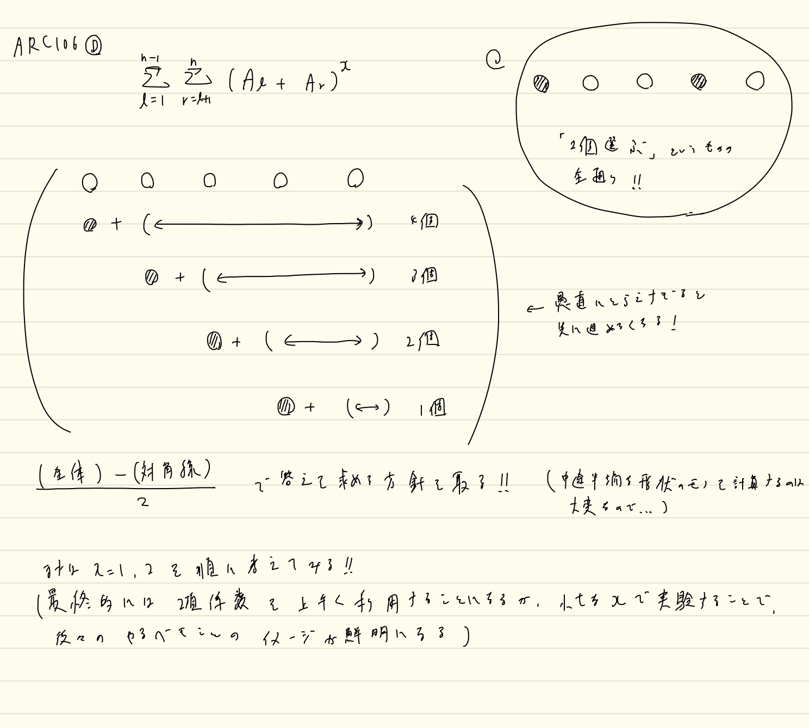

# AtCoderのupsolveした問題たち

Last Change: 2020-11-03 17:36:43.

「コンテストに出て解けなかった問題の復習」というのはひときわ学習効果が高いと思うので、
@2020-11-01からではあるが、このディレクトリ内にまとめていく。

---

## [ARC104 C.Fair Elevator](https://atcoder.jp/contests/arc104/tasks/arc104_c)

※解法の概要は理解したが、実装が非常に大変そうなので、upsolveはあとに回している。

## [ABC179 F.Simplified Reversi](https://atcoder.jp/contests/abc179/tasks/abc179_f)

一応自力で解き直した。  
純粋に区間更新だけが可能な遅延セグ木を2本作ることでシミュレーションを効率化した感じ。  
こういった遅延セグ木の代わりになるもっと簡易なデータ構造ってないものだろうか。。

解説放送では、「点chmin更新、区間min取得」のセグ木でできることを説明している。

※「区間更新・点取得」→「点更新・区間取得」の変換は重要な気もするけど、
脳死で遅延セグ木使えるほうがコンテスト的には大事だと思うので、一旦は忘れておく。。

## [ABC181 F.Silver Woods](https://atcoder.jp/contests/abc181/tasks/abc181_f)

最小包含円の問題を思い出すような、易しめの幾何の問題。

半径を決め打って判定する問題を二分探索するのはわかるが、具体的な方法は回答PDFを見た。  
全ての点と点の間の距離を計算し、この距離が `2*r >= dist` ならば通れることがわかる。  
同様なことは点と直線に関しても言える。  

ここで、点と直線を頂点とみなして `n+2` 個の頂点からなるグラフを考える。  
また `2*r < dist` を満たす点と点、および点と直線、直線と直線の間にエッジを張る。  
最終的に、「直線ノードと直線ノードが連結ならば通り抜けられない」というふうに言い換えることができる。  
回答PDFには「右手法をイメージすれば良い」とあるが、まさに「エッジがはられている間は通り抜けられない」ことからも、
直線と直線が連結でなければ、なんらかの抜け道がある、と判定できる。

とても賢く、きれいな問題。

## [ARC106 D.Powers](https://atcoder.jp/contests/arc106/tasks/arc106_d)

シグマの扱いがうまくなりそう、プラス、二項係数の理解が深まりそうな問題。  
求められる考え方や式変形はかなり典型っぽい考え方に見えるので、復習の際は以下をやってみるといい気がする。

- 回答PDFの式変形を（理解しながらゆっくり手で）写経する。
- 解説放送を聞き直す。
  - 典型っぽい考え方のポイントを教えてくれている。
    - e.g.: シグマの順番をforループの順番を入れ替えるように入れ替えても良い、展開してそれぞれの項の和を考える、など。

**※二項係数は手計算だとめんどくさいイメージがあるが、「コンピュータにとっては処理しやすいきれいなもの」というイメージを持っておくといい気がする。**

実際に実装してみたら、改めてMOD計算周りで注意すべき点が見えた。

- `modpow, invmod` はかならず前計算しておく。
  - 特に後者は `logN` レベル以上に聞いてくるので厳守すること。
- 階乗計算も安全に行うのであれば逐一やったほうが良いが、ミスを避けるためにも組み合わせライブラリを使うのもあり。
  - 適当に大きすぎる値を取らないこと。1Mぐらいで取るとプラス400msecは覚悟する必要がある。

※[ccppjsrbさんはmodintを自作して使っているらしい](https://atcoder.jp/contests/arc106/submissions/17669427)。。

