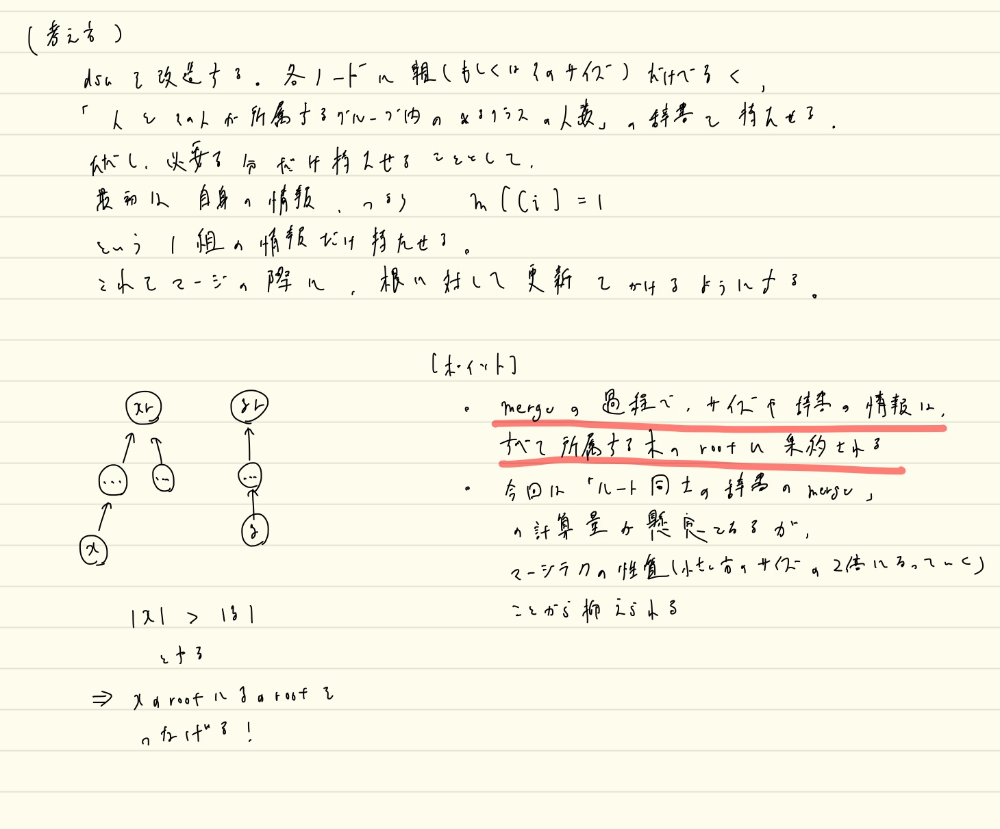
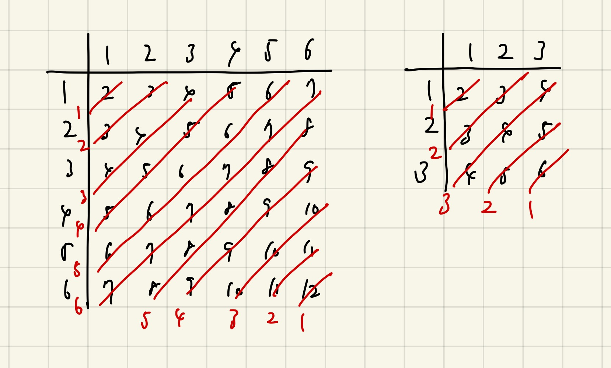
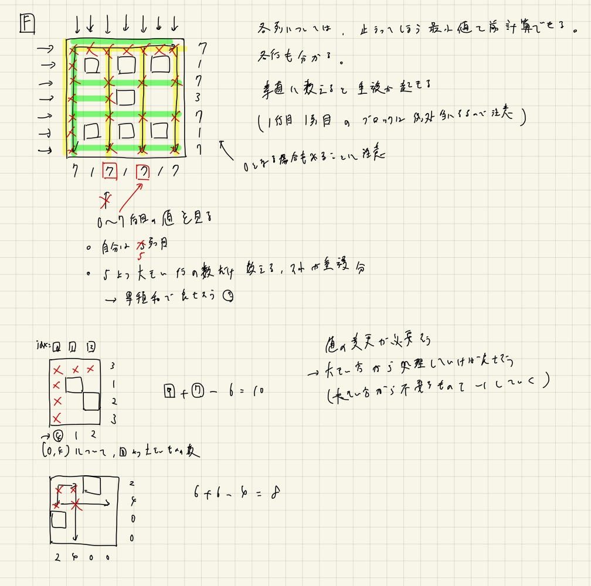
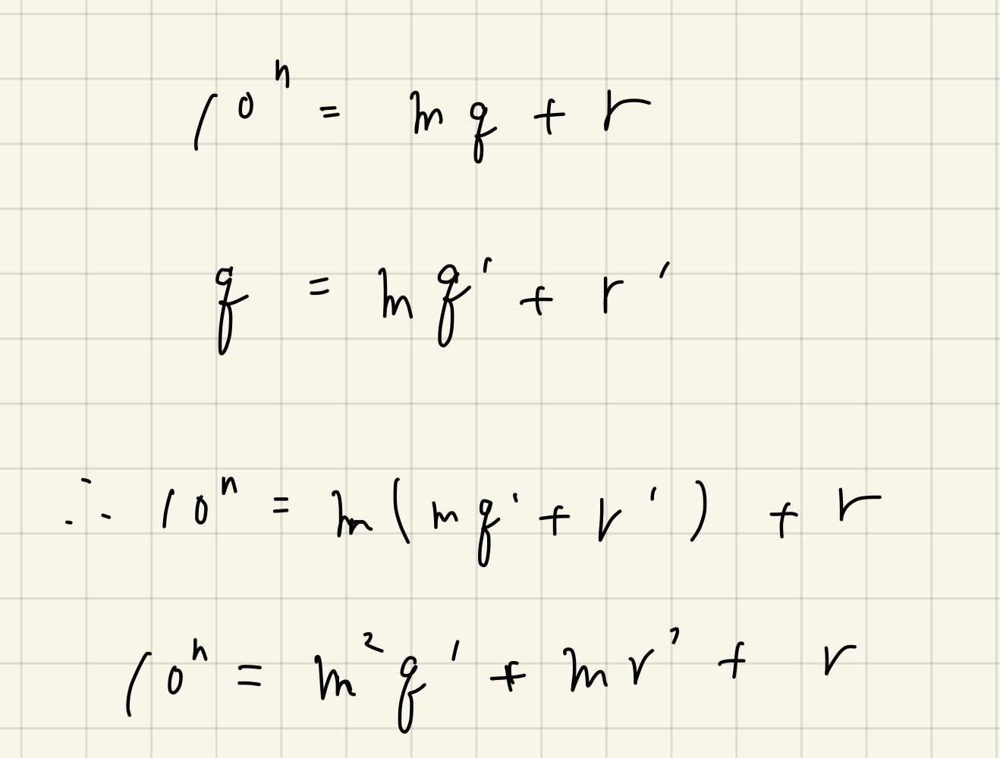

# AtCoderのupsolveした問題たち

Last Change: 2021-03-15 01:05:59.

「コンテストに出て解けなかった問題の復習」というのはひときわ学習効果が高いと思うので、
@2020-11-01からではあるが、このディレクトリ内にまとめていく。

---

## [ARC104 C.Fair Elevator](https://atcoder.jp/contests/arc104/tasks/arc104_c)

※解法の概要は理解したが、実装が非常に大変そうなので、upsolveはあとに回している。

## [ABC179 F.Simplified Reversi](https://atcoder.jp/contests/abc179/tasks/abc179_f)

一応自力で解き直した。  
純粋に区間更新だけが可能な遅延セグ木を2本作ることでシミュレーションを効率化した感じ。  
こういった遅延セグ木の代わりになるもっと簡易なデータ構造ってないものだろうか。。

解説放送では、「点chmin更新、区間min取得」のセグ木でできることを説明している。

※「区間更新・点取得」→「点更新・区間取得」の変換は重要な気もするけど、
脳死で遅延セグ木使えるほうがコンテスト的には大事だと思うので、一旦は忘れておく。。

## [ABC181 F.Silver Woods](https://atcoder.jp/contests/abc181/tasks/abc181_f)

最小包含円の問題を思い出すような、易しめの幾何の問題。

半径を決め打って判定する問題を二分探索するのはわかるが、具体的な方法は回答PDFを見た。  
全ての点と点の間の距離を計算し、この距離が `2*r >= dist` ならば通れることがわかる。  
同様なことは点と直線に関しても言える。  

ここで、点と直線を頂点とみなして `n+2` 個の頂点からなるグラフを考える。  
また `2*r < dist` を満たす点と点、および点と直線、直線と直線の間にエッジを張る。  
最終的に、「直線ノードと直線ノードが連結ならば通り抜けられない」というふうに言い換えることができる。  
回答PDFには「右手法をイメージすれば良い」とあるが、まさに「エッジがはられている間は通り抜けられない」ことからも、
直線と直線が連結でなければ、なんらかの抜け道がある、と判定できる。

とても賢く、きれいな問題。

## [ARC106 D.Powers](https://atcoder.jp/contests/arc106/tasks/arc106_d)

シグマの扱いがうまくなりそう、プラス、二項係数の理解が深まりそうな問題。  
求められる考え方や式変形はかなり典型っぽい考え方に見えるので、復習の際は以下をやってみるといい気がする。

- 回答PDFの式変形を（理解しながらゆっくり手で）写経する。
- 解説放送を聞き直す。
  - 典型っぽい考え方のポイントを教えてくれている。
    - e.g.: シグマの順番をforループの順番を入れ替えるように入れ替えても良い、展開してそれぞれの項の和を考える、など。

**※二項係数は手計算だとめんどくさいイメージがあるが、「コンピュータにとっては処理しやすいきれいなもの」というイメージを持っておくといい気がする。**

実際に実装してみたら、改めてMOD計算周りで注意すべき点が見えた。

- `modpow, invmod` はかならず前計算しておく。
  - 特に後者は `logN` レベル以上に聞いてくるので厳守すること。
- 階乗計算も安全に行うのであれば逐一やったほうが良いが、ミスを避けるためにも組み合わせライブラリを使うのもあり。
  - 適当に大きすぎる値を取らないこと。1Mぐらいで取るとプラス400msecは覚悟する必要がある。

※[ccppjsrbさんはmodintを自作して使っているらしい](https://atcoder.jp/contests/arc106/submissions/17669427)。。

## [ABC183 F.Confluence](https://atcoder.jp/contests/abc183/tasks/abc183_f)

マージテクと呼ばれるものを活用して計算量を抑える。  
実例でいうと、UnionFindのunion by sizeのアルゴリズムに該当するもの。

結論から言うと「Union Findのアルゴリズムをどれだけ深く理解しているか？」が問われた問題だったように思う。

> しかし、各生徒が属している集団の大きさは、移動が行われるごとに2倍以上になるため、
> 各生徒について移動が行われる回数は高々 `O(logN)` 回です。

小グループのleaderの辞書を大グループのleaderの辞書に併合することを「生徒の移動」と考えることができる。  
各生徒一人ひとりについて見ると、異なるグループの移動は対数オーダーで押さえられることがわかる。

※UninoFindのアルゴリズムを暗記してかけるようになるぐらいなじませたほうがいいかもしれない。。  
※ACLの命名規則は参考になるのかもしれない（rootよりはleaderという捉え方のほうが大事。）

### 追記@2021-01-10

Union Findのアルゴリズムをちゃんと理解しておけば、ライブラリに手を加えなくてもちゃんとACできるコードが書ける。  
`Leader()` を巧く使うこと！

## [ABC184 C.Super Ryuma](https://atcoder.jp/contests/abc184/tasks/abc184_c)

ハイパー難しい。  
ただ45度回転の問題としてはかなりいい題材の一つかもしれない。  
45度回転の復習の際にはまた取り組みたい。

45度回転はまだまだまだまだ慣れが必要だが、現状でも最低限以下は押さえておきたいかもしれない。

- 座標系: `(x, y) => (x+y, x-y) = (x', y')`
  - 行列の回転を素直に考えると `(x, y) => (x-y, x+y)` とすべきっぽい？
- 2点間のマンハッタン距離: `|x1-x2| + |y1-y2| => max(|x1'-x2'|, |y1'-y2'|)`
  - ななめの菱形から、 `x', y'` 軸それぞれに平行な正方形を考えるイメージになる

あとはグリッド一般的に以下の性質は別個に押さえておきたい。

- 斜め移動だけではパリティを変えられない
  - 市松模様、二部グラフ
  - 白からは白にしか、黒からは黒にしか行けない

### evimaさんの解法

[evimaさんのツイート](https://twitter.com/evima0/status/1331479659964350465)で、動画で解説をしてくれている。

この解法では45度回転といった難しいことは考えておらず、以下がポイントとなっている。

問題を「正規化」している。  
具体的には、片方が原点、もう片方が第一象限に来るように問題を変換している。  
片方を原点に寄せるのは、単に平行移動してやれば良い。  
こうすると、もう片方が必ずしも第一象限に来るとは限らないが、x,y座標どちらについても、負の座標であった場合は、
鏡写しにするイメージで反対側に持ってくる、すなわち符号反転してしまっても一般性は失われない。

このように正規化して考えると、市松模様といったものも考える必要がなく、また1,2手で進められる範囲のイメージもだいぶ易しくなる。

## [ABC184 D.increment of coins](https://atcoder.jp/contests/abc184/tasks/abc184_d)

期待値DP。  
条件付き期待値や条件付き確率を考えなくてよいあたりは、EDPCのSushiよりは優しい。

## [ABC184 E.Third Avenue](https://atcoder.jp/contests/abc184/tasks/abc184_e)

一工夫必要な最短経路問題。  
ワープについて愚直に辺を貼ってはいけないので、その点に対して工夫が必要。

- ワープは一回しか使わないように注意しつつBFSを実装する。
- ワープを超頂点として辺の数を増やしすぎないように工夫してからダイクストラもしくは01BFSに帰着させる。

後者のやり方は練習として別途実装したい。

### 超頂点を加えるやり方

思ったよりもグラフの拡張部分の実装は楽だった。  
ただ、悲しいことにダイクストラではTLEを回避できなかった。  
一方で、グラフはそのままに01BFSにかけてやったところ、無事AC出来た。

01BFSのライブラリはあまり使い慣れていないが、隣接リストのグラフさえ正しく作れてしまえばあとは関数に放り投げるだけなので、
使えるときは恐れずに活用していきたい。

追記@2020-12-12

なぜか01BFSの実装をミスった（コスト0の辺を持たない）が、AC出来ていた。  
01BFSは辺コストが2種類というだけじゃだめで、「0か非負の値一種類」が正しく動作するための条件だと思っているが。。？

## [ARC109 C.Large RPS Tournament](https://atcoder.jp/contests/arc109/tasks/arc109_c)

結構難しいDPだと思うが、みんな解けていて驚く。  
ただ、DPだと意識しなくても解ける開放があるので、そのせいもあったのかもしれない。

`dp[i][j] := 始点i(mod n), 長さ2^jのトーナメントの勝者の手（グー or チョキ or パー）`

実装はメモ化再帰が楽だと思う。  
遷移で `2^k mod n` を計算する必要があり、何かしらの方法で前計算すれば、全体の計算量は `O(n * k)` になると思う。  
制約が小さいのが微妙にいやらしい。

以下の点を意識するのがポイントになるかもしれない。

- とどの詰まり、「周期性」というのを強く意識すること
  - まず問題の題材的に、与えられた文字列が無限回catされるようなものを扱っているので、そもそも周期的である。
  - 「周期を巧く扱えばどうにかして解ける」というのを強く意識する必要があったかもしれない。
- 周期 `n` ということはつまり、状態が `n` 個しかない、という見方ができる（？）
- `2^k` 人のトーナメントというのが、そもそもきれいな再帰構造を持っている。

## [ARC107 B.Quadruple](https://atcoder.jp/contests/arc107/tasks/arc107_b)

本番でも解けた問題ではあるが、ものすごく時間がかかったし場合の数の考察も甘かったので復習する。

この問題は、以下の問題が解けてしまえばほぼ終りとなる（あとは全探索するだけになる）。

> `1 <= x, y <= n` をとる `x, y` について `x + y = k` となる異なるペア `(x, y)` の個数を求めよ。

`n = 6` とすればちょうど「区別できる6面サイコロを2つ振ったときの和が `k` となるサイコロの出方」と等しくなる。  
ここから具体的に考えると、色々と整理ができる（図も参照する）。

- 取りうる範囲が `[2, 2 * n]` であることはすぐわかる。
- 取りうる範囲が `n` のパリティによらず偶数から偶数の間であるため、値の種類は必ず奇数となる。
- それぞれの値についての頻度は、図の行列から分かる通り `1, 2, 3, .., n, n+1, n, .., 1` となる。
- これの一般化は容易であり、和の値を `x` とすると `min(abs(x-2)+1, abs(x-2*n)+1)` となる。

本番でもこれぐらい手で実験してから落ち着いて解くべきだった。。

## [ABC186 F.Rook on Grid](https://atcoder.jp/contests/abc186/tasks/abc186_f)

コンテスト後に自力で解けたが、考察も実装もかなり時間がかかってしまった。

方針としては、縦横で通れる可能性のあるマスを単純な方法で数え上げて、あとから重複して数えた分を削減してやるという方法をとった。  
この「重複分を削減する」箇所がポイントとなる問題だったように思える。

とりあえず、以下の画像が考察ノート。

説明がしづらいが、各列ごとに重複分を数えるようなイメージを持った。  
例えば、列 `cidx` を見ているとするとき、その列の重複分は、
`[0, C[cidx]]` の範囲の各行について、到達可能なマスの数が `cidx` より大きいもの、といえる。  
この部分の数え上げは、一見して累積和だけで行けそうな気もするが、 `[0, C[cidx]]` という範囲が限定されているため、
平面走査的に考えてやる必要がある。  
つまり、処理する列の順序は任意のため、範囲が広いものから処理していけば、次以降では見なくて良い部分を除外していくだけで良い。  
よって、fenwick treeなどを使うと、正確に数え上げることができる。

今回は0-indexで考えるときれいに整理できたが、このあたりは問題によってまちまちな気がするので、
臨機応変に対応したい。

※ 公式解説では、列について到達可能な数を数えた後、各行についてはそれまでに数えられなかった分だけを数える方針をとっているようだった。  
この場合、各行についてみるときに、すでに上の行で障害物が登場しているか？というのを各列について見ることで判断できる。  
この方法だと、制約がもう少し厳しくても解けるのかもしれない。  
とはいえやはり **数え上げの基本は重複を数えないように排他的になるよう工夫する** という観点で考えると、こちらの方法の方が良いかもしれない

## [ABC186 E.Throne](https://atcoder.jp/contests/abc186/tasks/abc186_e)

重要な整数問題。

`s + k*x == 0 (mod n)` を満たす最小の正の整数 `x` を求める問題。  
自分は `k*x + s = n*y` を変形して不定方程式のある解から目的のものを求める方向に考えたが、最小の正の整数 `x` を求める方法がわからず撃沈してしまった。

これは `k*x == -s (mod n)` という、合同方程式と呼ばれるものを解けば良いだけであるといえる。  
これは、 `n` が素数でない場合の `k` の法 `n` についての逆元を求めれば解けることになる。  
そしてこれは拡張ユークリッドの互除法で高速に求められる。

最初自分は、「なぜ `x == k^(-1) * (-s) (mod n)` によって求まる `x` が最小の正の整数なのか？」と気になったが、
`mod n` の世界ではどう考えても最小の正の整数で当然だった（次に大きいものは `x+n, x+2*n` と続く）。

具体的な解き方は[けんちょんさんのブログ記事](https://drken1215.hatenablog.com/entry/2020/12/20/015100)に詳しく書かれている。

## [ABC187 E.Through Path](https://atcoder.jp/contests/abc187/tasks/abc187_e)

適当な根を決めて根付き木とする。  
すると更新クエリは、「自身を含めた部分木の子孫の集合Aをプラス」もしくは「A以外をプラス」の二者択一となる。  
前者は自然にDFSで子孫以下に伝搬させればよいので簡単。  
後者は「根からプラスを全体に伝搬させ、特定の部分木にはマイナスを伝搬させる」と考える。  
これによって、後からまとめて処理するときに「A以外をプラス」を実現できる。

**木上のいもす法** とでも命名できそうな手法だと感じた。

全くわからず、同レベル帯のみんなが解けていて驚いたが、たしかに新しい知識は必要なかった。  
とはいえ、自分にとっては初めてやる内容に見えたので、難しかった。

※ オイラーツアーとかHLDとかの単語も見えたので、そういったツールを使いこなせると脳死で解けるのかもしれない。  
オイラーツアーに関しては汎用性が高そうなので覚えておきたい。

## [ABC187 F.Close Group](https://atcoder.jp/contests/abc187/tasks/abc187_f)

部分集合を列挙するタイプのbitDPだった。  
なんか経験したことはあるのに難しく感じて全然気づけかった。  
bitDPを再特訓したほうがいいのかもしれない。。

「誘導部分グラフ」という概念はこれを機にしっかり思い出しておこう。

実装に関してもかなり詰まってしまった。  
部分集合を列挙するときは、空集合を扱っていいかは注意したほうがいい。  
また、今回の問題は個人的にはトップダウンで考えたほうが実装しやすいと感じたが、
再帰だと3ケースTLEしてしまった（おそらくギリギリだったはず）。
非再帰でも大丈夫な問題は非再帰でも早く書けるように訓練したい。

※ optさんによると[これ](https://atcoder.jp/contests/arc099/tasks/arc099_c)が類題らしい。。？

### 部分グラフと誘導部分グラフ

[wikipediaより](https://ja.wikipedia.org/wiki/%E8%AA%98%E5%B0%8E%E9%83%A8%E5%88%86%E3%82%B0%E3%83%A9%E3%83%95#:~:text=%E3%82%B0%E3%83%A9%E3%83%95%E7%90%86%E8%AB%96%E3%81%AB%E3%81%8A%E3%81%84%E3%81%A6%E3%80%81%E8%AA%98%E5%B0%8E%E9%83%A8%E5%88%86,%E4%B8%80%E8%87%B4%E3%81%99%E3%82%8B%E3%82%B0%E3%83%A9%E3%83%95%E3%81%A7%E3%81%82%E3%82%8B%E3%80%82)

ポイント:

- 部分グラフは、元のグラフの「任意の頂点と任意の辺」を選択して取り出したグラフ
- 誘導部分グラフは、元のグラフの「任意の頂点のみ」を選択して取り出されるグラフ

誘導部分グラフの辺は、「取り出した頂点間の辺の有無が元のグラフとすべて同じである」ような集合となる。

## [ARC111 A.Simple Math 2](https://atcoder.jp/contests/arc111/tasks/arc111_a)

色々な考え方があるらしいが、個人的には以下のような式変形を考えるのが良いと感じた。  
こうすると、結局 `m^2` で割ったあまりにまずは着目すれば良いと解る。

※ 解説放送では `m` 進数をイメージすると良い、という説明がなされており、なるほどと思った。  
※ `m` の割り算を2回やっているんだから `m^2` で考えるのは良さそう、とざっくり考えるところから考察を進めるのが良かったかもしれない。

## [ARC111 B.Reversible Cards](https://atcoder.jp/contests/arc111/tasks/arc111_b)

[この問題](https://atcoder.jp/contests/chokudai_S002/tasks/chokudai_S002_k)がほぼ完全に既出だった。  
ただし座標圧縮が必要。

色をノードとしたグラフを考えると、連結成分や木グラフを考えたくなり、なんとなく以下の性質が成り立ちそうだと見えてくる。

- `n` 頂点の木グラフの場合、そこで `n-1` 色が作れる。
- `n` 頂点の任意の閉路を含むグラフの場合、そこで `n` 色が作れる。

本番中はこれの正当性が示せなかったが、解説放送では以下のように主張していた。

- 根付き木を考えると、根以外の進行方向の色を選ぶことで、根の色以外は取れる。
- 根は好きに選んで良い。
- 木じゃないループを含む連結成分の場合は、全域木を適当に考えたときの余分な辺について、両端のノードの適当な片方を根とすれば、余分な辺を使って根の色を選ぶ事ができる。

初見での実装は、DFSによって連結成分サイズとループの有無を調べたが、バグに怯えるようなコードになってしまった（一発ACではあったが）。

解説放送によると、Union Find木を使って、次数に着目することでも連結成分内の辺の数が数えられることがわかったので、
この方法は覚えておきたい。

## [ABC188 F.+1-1x2](https://atcoder.jp/contests/abc188/tasks/abc188_f)

[類題](https://atcoder.jp/contests/agc044/tasks/agc044_a)を以前に経験していたのに解けなくてとてもダメ。

今回も逆から考える。  
類題と同じく、最もキーとなる考察は、以下の部分。

> `k >= 2` の場合について、「`k`回`1`を足してから`2`で割る」という操作と「`k-2`回`1`を足す、`2`で割る、`1`回`1`を足す」という操作は
> それぞれ得られる結果が等しく、また回数については後者の方が優れている。  
> また、引き算についても同様の主張ができる。

計算量解析はやはりむずかしい。  
今回の単純な問題設定では、Editorialのように不等式を用いて割とわかりやすく説明できるが、
同様の説明をPay to Winの問題に適用すると、定数倍が大きい雑な計算量見積もりになってしまう気がする。

[こちらのブログ](https://sen-comp.hatenablog.com/entry/2020/05/27/015454)では、
大雑把な見積もりが説明されているが、個人的にはあまり腑に落ちなかった。

とりあえずは、「等価な操作の言い換えにより、問題を単純化してしまった後は、やや非自明なことに、
切り上げ切り捨てを許したとしても到達できる状態数は非常に少ない（割り算の回数を `d` 回とすると、それぞれの回数では定数個しかない）」というのを、
感覚的に覚えておくほうがいいかもしれない。

