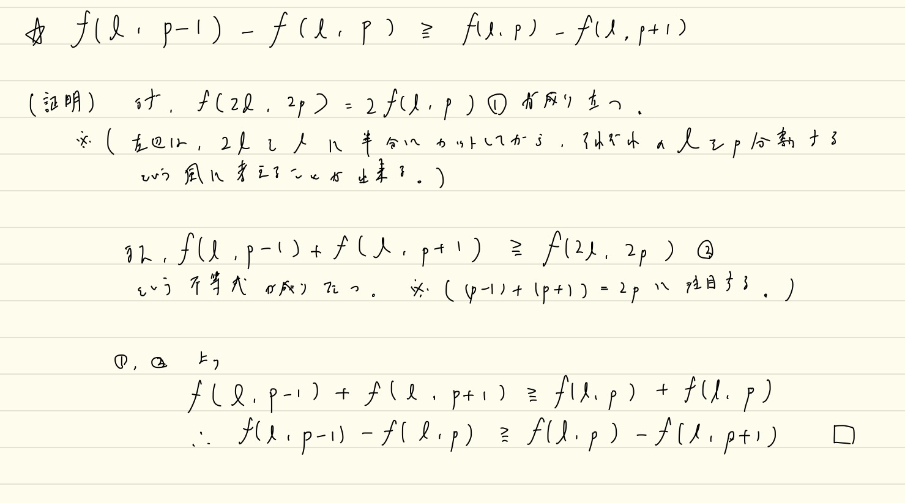

# Codeforcesのupsolveした問題たち

Last Change: 2020-12-05 16:48:42.

## [Raif Round 1 E.Carrots for Rabbits](https://codeforces.com/contest/1428/problem/E)

解説は画像のとおりだが、本問題における `F(l, p)` という関数と、この問題で使用する性質は他の問題でも応用できそうなので、
丸暗記してしまってもいいのかもしれない。

追記: 肝となる不等式の証明も追加。

## [CR681 div2 D.Extreme Subtraction](https://codeforces.com/contest/1443/problem/D)

Editorialがちょっと読みづらいが、結局やりたいことは当初自分が考えていた内容と近いものだった。  
おそらく、自分の解法は、増加列なるべき配列Bが、正しく増加列とならないような実装になっていた。

もう少し自分の方針を具体化すべきだったかもしれない。

## [CR687 div2 D.XOR-gun](https://codeforces.com/contest/1457/problem/D)

最上位ビットに注目すると、最上位ビットが同じものが3つ連続している連続部分列があると、答えは必ず1となる。  
なぜなら、3つのうち後ろ2つをXORすると、最上位ビットが打ち消されて、必ず残った1つがXORされた結果を上回るからである。

。。ここはコンテスト中に気づけたのに、そこから次の単純かつ強力な事実に気づけなかった。。  
今回の制約ではせいぜい32ビット考えれば十分で、よくよく考えると `n` が大きければ上述のような3つの連続部分列は存在せざるを得ない。  
これは、鳩の巣原理的に考えれば自然とわかる。

参考: [高校数学の美しい物語: 鳩の巣原理を使う数学オリンピックの問題](https://mathtrain.jp/pigeon)

よって、ここでは `n < = 100` という制約のもとで解ければ十分となる。  
結果の作り方としては以下の2パターンで十分。

- ある1つの連続部分列をXORして、もとの数列のその前後との大小関係を比較する
- 2つの連続部分列で、それらが隣接している場合、その2つの連続部分列のXOR同士の大小関係を比較する

巧くやれば実装もきれいになる。

**この手の「実はよく考えると巨大な制約は考えなくて良くなる」というのは、最近のAtCoderでもちらほら見かける気がするので、**
**考察の1つの手札として持っておきたい。**

## [CR688 div2 C.Triangles](https://codeforces.com/contest/1453/problem/C)

やりたいことはぼんやりわかるが、かなりやりたくない気持ちになる実装系の問題。  
実際は「底辺（行・列に並行な三角形の辺）を作るためにしか、あるマスの変更は考えなくて良い」という事に気づけると、
かなり前向きになれる。  
この性質は、仮に底辺に含まれない他の唯一の点を作るためにセルの桁を変更すると仮定すると、
そのような変更するセルは、面積を変えずに同じく行・列のいずれかに平行にできることから主張できる（等積変形というやつ？）。

実装としては、以下をかき集めることが大事になると思う。

- 各数字について行ごとの最小・最大の番号
- 各数字について列ごとの最小・最大の番号

`chmax, chmin` 関数を豊富に使ってできるだけ楽をしたい。  
といっても、後半部分の面積計算部分は頭がこんがらがってしまう。。

