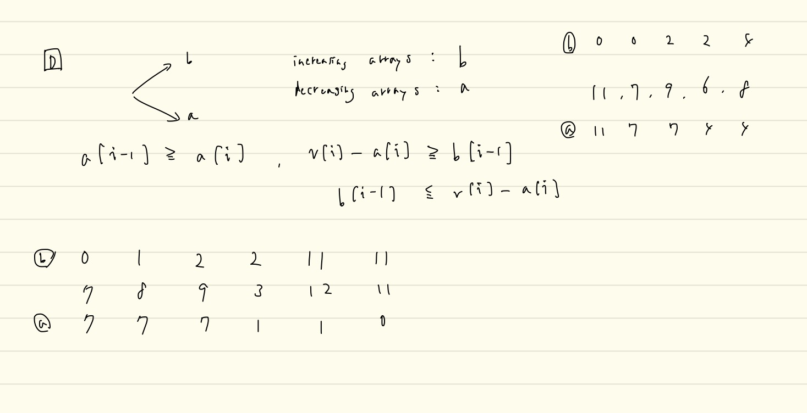

# Codeforcesのupsolveした問題たち

Last Change: 2020-11-03 13:03:04.

## [Raif Round 1 E.Carrots for Rabbits](https://codeforces.com/contest/1428/problem/E)

解説は画像のとおりだが、本問題における `F(l, p)` という関数と、この問題で使用する性質は他の問題でも応用できそうなので、
丸暗記してしまってもいいのかもしれない。

## [CR681 div2 D.Extreme Subtraction](https://codeforces.com/contest/1443/problem/D)

Editorialがちょっと読みづらいが、結局やりたいことは当初自分が考えていた内容と近いものだった。  
おそらく、自分の解法は、増加列なるべき配列Bが、正しく増加列とならないような実装になっていた。

もう少し自分の方針を具体化すべきだったかもしれない。

