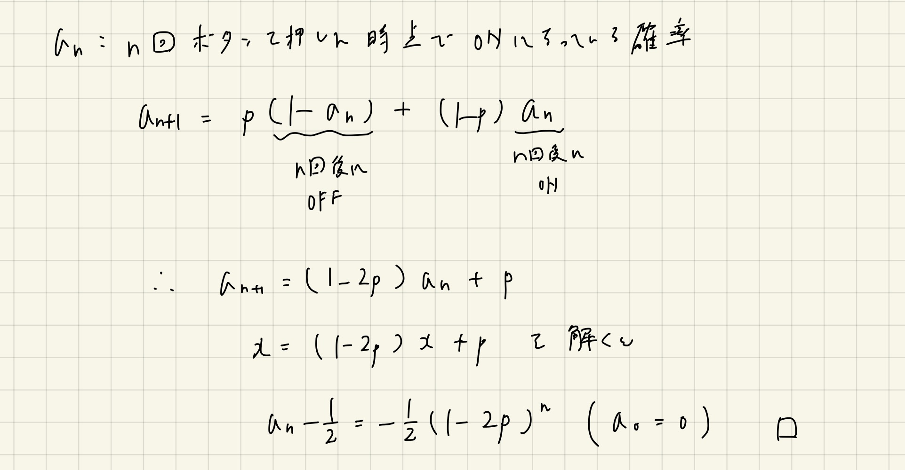
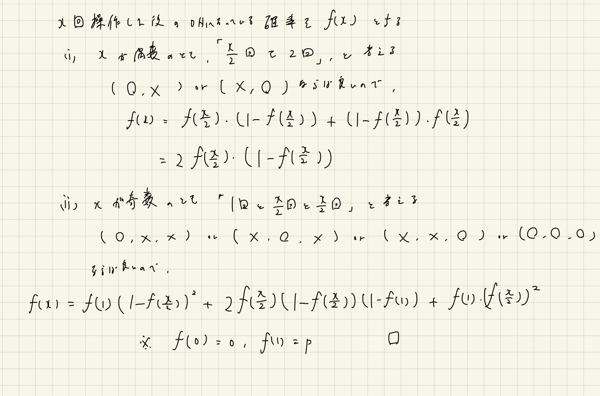
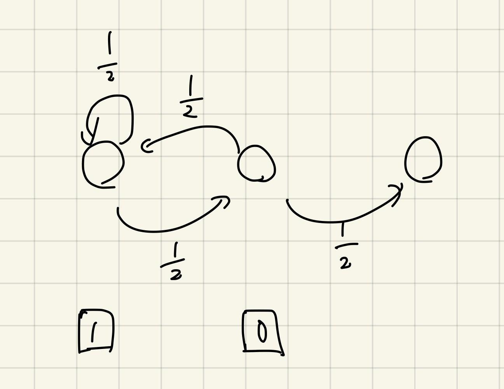

# 確率DP

Last Change: 2021-01-19 00:45:45.

期待値DPが一番の勉強目的だったが、確率DPや期待値の線形性といったトピックも一緒に学ぶ。

## 参考

- [確率DPを極めよう](https://compro.tsutaj.com//archive/180220_probability_dp.pdf)
- [けんちょん氏のABC078-C HSIの解説](https://drken1215.hatenablog.com/entry/2019/03/23/175300)
- [「〜がすべて終わるまでの試行回数の期待値」を求める一般的なフレームワーク](https://drken1215.hatenablog.com/entry/2019/03/23/214500)
- [「期待値の線形性」についての解説と、それを用いる問題のまとめ](https://qiita.com/drken/items/3fe1613c44de1f3bfbe1)
  - かなり易しいところから始めてくれるので、迷ったら読み返すと良い。

## スタータパック

[ZRK+94さんのツイートより](https://twitter.com/Zen_Re_Kkyo/status/1135152582194651136)より

- [AtCoder社の給料](https://atcoder.jp/contests/abc003/tasks/abc003_1)
- [HSI](https://atcoder.jp/contests/abc078/tasks/arc085_a)
- [Theme Color](https://atcoder.jp/contests/code-festival-2018-final/tasks/code_festival_2018_final_b)
- [デフレゲーム](https://atcoder.jp/contests/tkppc3/tasks/tkppc3_e)
- [Ordinary Beauty](https://atcoder.jp/contests/soundhound2018-summer-qual/tasks/soundhound2018_summer_qual_c)
- [Removing Blocks](https://atcoder.jp/contests/agc028/tasks/agc028_b)
- [Modulo Operations](https://atcoder.jp/contests/exawizards2019/tasks/exawizards2019_d)

## コツ？

- 状態遷移図を書いてみることは意味がありそう。

## 必要な知識

知識を頭に常においておくのが良いと思う。  
できれば証明も併せて頭に入れておきたい（証明における考え方自体も応用範囲が広いように思えるので）。

- 確率 `p` で成功する試行について、成功がでるまでの期待値は `1/p`
  - 超典型
  - 「 `m` 回成功が出るまでの回数」というのを考える場合もある。これについてはシンプルに `m*(1/p)` でよい。
- コンプガチャ問題
  - この考え方がそのまま応用できるものも少なくないように見える。
    - https://qiita.com/drken/items/3fe1613c44de1f3bfbe1#4-1-%E3%82%B3%E3%83%B3%E3%83%97%E3%82%AC%E3%83%81%E3%83%A3%E5%95%8F%E9%A1%8C
    - https://mathtrain.jp/completegacha
- 余事象
  - 知識というよりは、常に武器として取り出せるようにしておきたい、という心構え。

---

## 問題例

### [yukicoder No.144 エラトステネスのざる](https://yukicoder.me/problems/no/144)

「期待値の線形性」を理解するのにとてもよい題材。  
解説はリンク先のPDFが非常にわかりやすいので、適宜そちらを参照すべし。

**「主客転倒」の概念も絡んでいる気がする。**

とはいえ、「そうなるから、そう」という感覚が正直拭いきれない。  
`X(S)` の定義が巧くて、自分でできるようになるのだろうか？という気持ちになる。

### [yukicoder No.108 トリプルカードコンプ](https://yukicoder.me/problems/no/108)

まずはDPテーブルの定義の仕方に壁がある（とはいえものすごい典型なのだとは思う）。 
個人的には、その次の「3枚以上引いてるカードは引かない場合の条件付き期待値、および条件付き確率」を考えている部分に壁がある。

ほぼ写経でコードを書いてしまったため、DPテーブルの定義は独自のものにアレンジしてみたが、自分のコードのほうが直感的でわかりやすい気がする。

**同じ状態にループしてしまうような遷移は省いて考える」というのが肝なのか？**

**「確率 `p` で起こる事象について、それが起こるまでの期待値は `1/p` 」というのは超典型なので暗記。**

参考: https://drken1215.hatenablog.com/entry/2019/03/23/175300

### [EDPC J.Sushi](https://atcoder.jp/contests/dp/tasks/dp_j)

トリプルカードコンプと全く同じ問題と思って良い。

### [ABC184 D.increment of coins](https://atcoder.jp/contests/abc184/tasks/abc184_d)

これもトリプルカードコンプやSushiと同じ。  
ただし、条件付き期待値や条件付き確率を考えなくてもよいあたり、この問題は確かに易しめだった。

### [SoundHound Inc. Programming Contest 2018 C.Ordinary Beauty](https://atcoder.jp/contests/soundhound2018-summer-qual/tasks/soundhound2018_summer_qual_c)

「期待値の線形性」の最初の練習に。  
`m-1` 個の区間1つ1つが01をとる確率変数だと思って、独立に計算して最後に足し合わせる。

### [ABC008 C.コイン](https://atcoder.jp/contests/abc008/tasks/abc008_3)

エラトステネスのざると一緒に勉強したい問題。  
ただし、ざるよりも確率の計算部分で頭を柔軟にする必要がある。

コイン一つ一つについて01をとる確率変数だと考えればよいのはすぐわかる。  
それぞれについて、「自身を除いた約数について、自分より左側に偶数個並ぶ確率」を求めることになるが、
これを素直に確率の定義に従って「分母は `n!` で分子は〜」と考え始めると泥沼。  
確率を正確に捉えてもっとシンプルに考えれば良い。

この場合は、自身および約数以外はないものとして考えればよい。  
また、約数についてもすべて同質のものと考えて1列に並べてしまい、それらの間に自身を挿入する、という状況を考える。  
すると約数の数を `m` としたときに `Ceil(m+1, 1) / (m+1)` で求まることがわかる。

場合の数に比べて、確率は考え方によっていくらでも簡単になったり難しくなったりするので、そこは訓練が必要。

※なんか2018年7月とかに通してた。こんな教育的問題を雑に消費してしまっていたなんて。。

### [ABC078 C.HSI](https://atcoder.jp/contests/abc078/tasks/arc085_a)

「確率 `p` で起こる事象について、それが起こるまでの期待値は `1/p` 」という超典型。  
できれば `e = (e+1)*(1-p) + p` という漸化式ももう暗記してしまうのが良い。

### [AGC049 A.Erasing Vertices](https://atcoder.jp/contests/agc049/tasks/agc049_a)

期待値の線形性だが、難しい。  
多分「この問題は期待値の線形性を使います！」って宣言されてても難しい。

[けんちょんさんの解説](https://drken1215.hatenablog.com/entry/2020/11/15/104400)が、思考過程も書かれており、勉強になる。  
最終的には、以下の確率変数が定義できると（なんとか）理解できる。

`X[v] := 頂点vが操作過程で削除対象として選ばれるとき1、そうでないとき0`  
こうすると求めるものは `E(X[0] + X[1] + ... + X[n-1]) = E(X[0]) + E(X[1]) + ...` となる。  
「ノードごとに「それが1回の操作としてカウントされる割合」」を求めていると、なんとか合点がいく。  
とはいえやはり難しい。。

「一本道のグラフ＝パスグラフ」というのは、地味に知識として漏れていたので覚えておく。  
構築などでも極端な例としてすぐ出てくるようにしたい。

参考: [基本的なグラフの種類](https://malibu-bulldog.hatenadiary.org/entry/20090516/1242455204)

※なぜか再帰関数と使って `v` に到達するノードの数を数えたら、半分以上のケースが通らなかった。  
グラフの形状によってはこれでは巧く数えられないのか？？

### [第6回ドワンゴからの挑戦状予選 B.Fusing Slimes](https://atcoder.jp/contests/dwacon6th-prelims/tasks/dwacon6th_prelims_b)

期待値の線形性。  
以前解いたことがあったが、理解度確認のために解き直した。

各区間について期待値を求めて足し合わせればよいが、期待値の具体的な計算方法をエスパーしてしまった。  
PDFの説明が簡潔で「スライム `i` がその区間を通るための条件」というのを、全てのスライムに考えてやるのが良い。  
ちょっと戸惑うが、例えば `i` を含めて右側に `4` 個スライムがいると考えると、全体が `4!` 通りで、
`(4-1)` 個のスライムが先に選ばれる通り数は `3!` 通り、よって確率は `3!/4! = 1/4` というふうに求まる。

**この問題のある区間の期待値部分は「コンプガチャ問題」が絡んでいると思われるので、やはりあの有名問題についても暗記してしまったほうが良さそう。**

※こういった問題で、最後にかけるべきものをかけるのを忘れる、といった凡ミスをなくしたい。。  
※解説放送のりんごさんの考え方も面白い（期待値漸化式から導出している）。

### [M-SOLUTIONSプロコンオープン C.Best-of-(2n-1)](https://atcoder.jp/contests/m-solutions2019/tasks/m_solutions2019_c)

純粋な期待値を求める問題。  
しかも（基本的には）定義どおりに期待値を求めれば良い、という問題。  
※りんごさんは↑のように解説放送で説明していたが、厳密には「条件付き期待値」の計算が求められているように思える。  
。。いや、条件付き期待値とは別のなにかの計算が求められているようにも見える。

以下の発想が重要となる。

1. 「引き分けがない場合」をまずは考える。
2. 次に「引き分けでないゲームが `m` 回行われた」という前提で、「引き分けを含めて何回試合が行われるかの期待値」を考える。
3. 「確率 `p` で成功する試行について `m` 回成功するまでに要するトータルの試行回数の期待値」は `m * (1/p)` である、というシンプルな事実

1,2の間で `(p, q) = (a/100, b/100) => (p', q') = (a/(a+b), b/(a+b))` というふうに、考える確率が（一見して）変わって見えるのが難しい。

**※ EDPCのSushiと同じく、条件付き確率を考えている部分は共通要素なので、その点を意識したい。**

### [TDPC C.トーナメント](https://atcoder.jp/contests/tdpc/tasks/tdpc_tournament)

確率DP。  
制約から素直に考えると正しいDPテーブルを定義できる。

`i` ラウンド目に `j` さんが戦う可能性のある人を列挙する部分がちょっとむずかしい。  
tsutajさんのPDFではなにやら賢そうな条件判定式があるが、自分は「2べきで割ったときの商が一致するか」と
「すでにjラウンドまでに戦う判定があったかどうか」の2つの条件を利用することで解いた。  
後者の条件は、単純にDPテーブルとは別に2次元行列で管理すれば、比較的簡単に実装できた。

### [dwangoプログラミングコンテスト C.ゲーマーじゃんけん](https://atcoder.jp/contests/dwango2015-prelims/tasks/dwango2015_prelims_3)

期待値DP。  
考え方は割とすぐわかるが、条件付き期待値を使う部分でBest-of-(2n-1)やEDPC-Sushiを彷彿とさせる。  
**求められるパーツや関連知識が非常に勉強になるので、個人的に重要問題。**

ただし、遷移が難しく感じる。。  
対称性などを巧く使わないと、微妙に漏れがあるようでほとんどのテストケースが通らない。  
ここは[LayCurseさんの解説](http://rsujskf.s602.xrea.com/?atcoder_dwango2015-prelims_c)にあったコードを一部参考にした。

※ 漸化式の部分はEDPC-Sushiと似ているが、こちらのほうが遷移が複雑なため、なるべく立式したほうが良い。  
その際、いきなり条件付き確率で考えるよりは、自己遷移を含めた期待値漸化式を正しく立式してから、式変形したほうが良い。

※ この問題では必須ではないが、 `P(r, s, p) := グーがR人, チョキがS人, パーがP人となる確率` を求める部分で、
漸化式（DP）を使って前計算する部分は参考になる。

#### 補習: 異なるN人のぐー・チョキ・パーの出され方の確率（パターン数）

`n` 人がランダムに手を出してグー・チョキ・パーがそれぞれ `r, s, p` 人となる確率を `f(r, s, p)` とする。

組み合わせの場合の数の公式を直接使うと、 `f(r, s, p) = (1/3)^n * (n!) / (r! * s! * p!)` で直接求まるが、
分母・分子の整数型のオーバーフローが懸念されるため、これはあまり良くないと思われる。  
ちなみに、今回の問題の制約ではなんとかなった。

これはDP的に求めるのがよく、以下のような遷移が成り立つため、実装上はメモ化再帰を行うのが良い。

`f(r, s, p) = (f(r-1, s, p) + f(r, s-1, p) + f(r, s, p-1)) / 3`

この遷移の解釈は「 `n-1` 人のパターンが決まった状態で、最後の `n` 人目がそれぞれグー・チョキ・パーとなる」という
排反事象の確率を足し合わせている、と考えることができる。

### [ABC011 D.大ジャンプ](https://atcoder.jp/contests/abc011/tasks/abc011_4?lang=ja)

ゲーマーじゃんけんの前にこちらを先に解くべきかもしれない。  
この問題では、パスカルの三角形の確率への応用が必要になる。  
また **自然な形で条件付き確率を導入することになるので、条件付き確率に迷ったらこの問題を解いてみるのが良いかも？**

#### 補習: `C(n, r) = C(n-1, r) + C(n-1, r-1)` と確率への応用

この公式はパスカルの三角形のなかでも使われるものだが、長年自分は組み合わせ的な解釈が出来ていなかった（代数的な証明は見ればわかる）。  
しかしながらよくよく調べると、[高校数学の美しい物語](https://mathtrain.jp/nikoukeisu)でちゃんと解説されていた。  
そこでの説明とは微妙に異なるが、自分が理解しやすいように解釈すると、以下のように考えることができる。

> `r` 人選ぶ方をグループAとする。  
> `n` 人目がグループA以外でグループAが `r` 人となるのは、 `C(n-1, r)` 通り。
> `n` 人目がグループAでグループAが `r` 人となるのは、 `C(n-1, r-1)` 通り。
> これらは排反で漏れがないので `C(n, r) = C(n-1, r) + C(n-1, r-1)` が得られる

今回の問題では、ある人がグループAかそれ以外かに選ばれるのは、それぞれ確率 `1/2` で等しいと考えることができる
（厳密には、条件確率によって、例えば「X軸の移動2択に絞られているという条件のもとで」そのように考えることができる）。  
パスカルの三角形の通り数に `(1/2)^n` を掛け算することで確率は得られるはずだが、通常通り数はオーバーフローしているはずなので、
これで一気に求めることは出来ない。  
よって、DPを行う。  
ちゃんと理解していると、以下のような配るDPでそれぞれの段の確率がうまく計算できることがわかる。

```
func initialize() {
	CP[0][0] = 1.0
	for i := 0; i+1 < 2000; i++ {
		for j := 0; j <= i; j++ {
			CP[i+1][j] += 0.5 * CP[i][j]
			CP[i+1][j+1] += 0.5 * CP[i][j]
		}
	}
}
```

### [CODE FESTIVAL 2014 Middle C.eject](https://atcoder.jp/contests/code-festival-2014-morning-middle/tasks/code_festival_morning_med_c)

確率の問題。  
この問題はかなり勉強になった。  
`n, n+1` の隣接二項間漸化式の一般項を求める、二分累乗法の要領でメモ化再帰で求める、
2進数展開を考えてダブリング的に求める（メモ化再帰も必要）、など色々な方法がある。

- [隣接二項間漸化式の一般項](http://mayokoex.hatenablog.com/entry/2015/10/03/074806)
- [二分累乗法の要領でメモ化再帰](https://kmjp.hatenablog.jp/entry/2014/11/10/1100)
- [2進数展開してダブリング的にメモ化再帰](https://kimiyuki.net/blog/2014/11/11/eject/)

隣接二項間漸化式はなるほどと思ったが、自分が漸化式の一般項の求め方をほとんど忘れていることや、
応用範囲の意味合いで、後者2つの方法が良いと感じた。

**確率の漸化式というと隣接二項間で考えたくなるが、特に今回のように制約が大きい場合は二分していくことやダブリングを検討できるようにしたい。**





二分累乗法のやり方は、奇数の際はノートのように細かく分ける必要はなく、
単に `f(1)*(1-f(x-1)) + (1-f(1))*f(x-1)` とやってしまったほうがスマート（実際に二分累乗法でもこのような実装を行っている）。

2進数展開の方では、「最上位ビット」と「それ以外」に分けて、同じ要領で考えた。  
※ kmykさんのやり方とは違うかもしれない。

※ メモ化再帰は必ずしも必要ないのかもしれないが、損はないと思うのでメモしたほうがいいと思う。

### [Codeforces Round 688 div2 D.Checkpoints](https://codeforces.com/contest/1453/problem/D)

[OEISのこれ](http://oeis.org/A000918)を知っていると即答できるのかもしれない。

基本的には、確率 `p` の事象が起こるまでの回数の期待値の応用を考えた。  
以下のような状態遷移図を考えて、直近のチェックポイントから `i` 個先に到達するのに必要な期待値を `dp[i]` として考えた。



これは、以下のような2項間漸化式を考えることで解けた。

```
dp[i+1] = dp[i] + 1/2 + (1/2) * (dp[i+1] + 1)

dp[i+1] = 2 * (dp[i] + 1)
```

気持ちとしては、すでに期待値が求まっているポイントまでは、その期待値の回数で進むことが出来、
その次にについては、

1. 確率 `1/2` で `1` ステップですすめる
2. 確率 `1/2` でチェックポイントまで戻され、 `1` ステップかかる上でそこから更に `dp[i+1]` ステップ必要

あとはこの前計算した期待値を貪欲に使っていく構築を行えば良い。

### コインの表が連続 `i` 回出るのに必要な回数の期待値

OEISでは「当確率で表が出るコインの、連続で `i` 回表が出るのに必要な回数の期待値」が一例として紹介されている。

最初、「コイン2連続表は `1/4` なのだから期待値は `4` では？」とか考えてしまった。  
よく考えたら、 `1/4` を引くにあたって回数自体は `2` 回振っているので、↑のように考えたら `2 * 4 = 8` となるべきだった。

しかし、実際にはこの期待値は `6` が正しく、 `8` 回というのは、回数としてかかりすぎた見積もりと言える。  
これは、例えば「裏表」という出方は3回目の試行での成功確率を上げる方向に作用している、などといったことからなんとなく理解できる。

### [第一回PAST O.持久戦](https://atcoder.jp/contests/past201912-open/tasks/past201912_o)

期待値DP。

`dp[i] := iが出たあとの、その後の回数の期待値` という定義は正しく出来た。  
しかし、これを愚直に考えると、 `n` 個あるサイコロのうち、どれを選ぶかの部分で、
最大値を計算するために `n` 通りいちいち計算しなければならず、計算量が二乗になってしまい間に合わない。

もう少し掘り下げて  
`dp[i] = (iより大きいものを引く) + (i以下のものを引く)` と考えるとわかりやすい。  
右辺は `n` 個のサイコロごとに独立して計算しておくことが出来、例えばあるサイコロ `?` が現在目 `x, y` が選出済みとすると、  
`D[?] = ((dp[x] + 1) + (dp[y] + 1)) * (1/6) + 1*(4/6)`  
というふうに表現できる。  
この式をよく見ると、目 `x` が選出されるたびにその目をもつサイコロ `?` について `D[?] += (dp[x]+1)*(1/6) - (1/6)` としてやれば良いことがわかる。

後は最後の答えの計算方法に気をつける（どのサイコロを最初に選ぶべきかで決める）。

