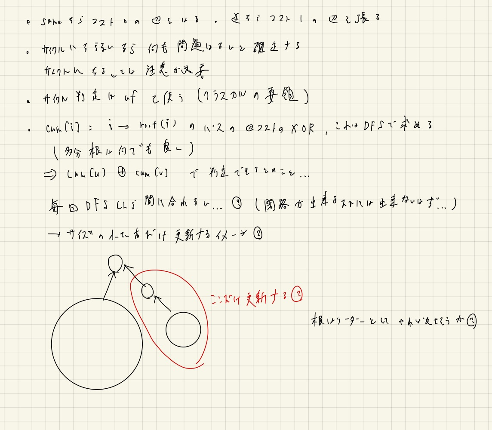

# マージテク

Last Change: 2021-01-12 23:05:22.

## 参考

- [原典](http://web.archive.org/web/20181213115442/http://topcoder.g.hatena.ne.jp/iwiwi/20131226/1388062106)
  - 秋葉さんの記事なので難しいのかと思ったら、自分が知りたかった内容がほぼすべて書かれていた。
- [はまやんさんの問題集](https://www.hamayanhamayan.com/entry/2017/02/10/132728)
  - 難しめの問題が多いが、秋葉さんの原典で列挙されているものよりは大分マイルドなはず。
- [けんちょんさんのABC183-F解説記事](https://drken1215.hatenablog.com/entry/2020/12/20/192100)
  - 参考に。

---

## 基本: Union Find木の復習

けんちょん本がコンパクトでわかりやすい。

肝になるインテーフェースは以下の3つ。

- `Same(a, b)`: `a, b` が同じグループかどうか
  - 根付き木の根ノードID同士を比較する
- `Merge(a, b)`: `a, b` を同じグループにマージする
  - 根付き木の根ノードをいずれか片方を、もう一方につなげる
  - union by sizeを行うと高速になる
- `Leader(a)`: `a` の根付き木の根ノードのIDをかえす
  - 根付き木の根ノードまでたどることで、根ノードIDを調べる
  - 経路圧縮を行うことで高速になる

以下の考え方がポイントになる。

- union by sizeによって任意のノード `x` について、別の根ノードの根付き木へと移動する（併合される、引っ越しする）回数はたかだか `logN` 回。
  - 自身の所属するノードのサイズが、併合されるたびに2倍になることから、最大でも `logN` 回しか「併合される」ということが起こらないから。
- 経路圧縮は `Leader()` メソッドが呼ばれたときに実行されるため、遅延評価的な側面がある。

## マージテク

自分は以下のように理解した。

> 「併合のたびにサイズが小さい方を **全探索** する」ときの計算量が、全体で `O(NlogN)` となる。

考え方は単純で、Union Find木のunion by sizeの通り、ある任意のノード `x` について、自身が併合される回数はたかだか `logN` 回であり、
`N` 個のノード全体で考えてやると掛け算で `O(NlogN)` になるということ（厳密ではないと思う）。

全探索という表現はあまり適切ではないかもしれない。  
自分が今までに経験した全探索は、以下のような処理。

- 小さい方に所属するメンバ情報をすべて、大きい方に所属するメンバ情報のメモリに引っ越しさせる。
  - [ABC183 F.Confluence](https://atcoder.jp/contests/abc183/tasks/abc183_f)
- サイズが小さい木を、大きい方の根付き木の適当なノードにつなげることで併合し、小さい木を部分木とみてその部分だけをDFSする。
  - [CR396Div2 D.Mahmoud and a Dictionary](https://codeforces.com/contest/766/problem/D)

---

## 問題

### [ABC183 F.Confluence](https://atcoder.jp/contests/abc183/tasks/abc183_f)

グループのリーダーに、自身のグループを構成するクラス情報を保持することを考えれば良い。  
クラスがすべて異なる場合がもっともわかりやすいが、最も時間がかかるパターンもこのパターンなので、
クラスはすべてバラバラだと思っておく。

小さい方から大きい方へ引っ越すときは、小さいリーダーが管理していたクラス情報を、
すべて大きい方のリーダーへ移してやればよい。  
クラスが全部バラバラだとすると、このとき小さいグループのサイズ分計算回数が必要となるが、
union by sizeの考え方から、個々のクラス情報についてこの引越の回数は `O(logN)` 回であるため、
全部のノードについて考えてもその `N` 倍しか必要にならない。

よって、ハッシュマップを考えるとトータルの計算量は `O(NlogN)` となる。

### [CR396Div2 D.Mahmoud and a Dictionary](https://codeforces.com/contest/766/problem/D)

単語を頂点としたグラフを考えるのがEditorialの解法。  
また、意味が等しいときはコスト `0` の辺を、意味が反対のときはコスト `1` の辺を張る。

グラフの構築過程に関して、以下のように考える。

1. `a, b` が非連結（別のグループである）ならば、それらはもともとは無関係だったので、特別なことを考えずにつなげてしまって良い。
2. `a, b` がすでに連結（同じグループである）ならば、矛盾があるかどうかのチェックが必要となる。

まず2のほうから考える。  
この矛盾のチェックのためには、以下のデータを考えることで `O(1)` で判定できる。

`cum[i]`: 適当なノードを根とした根付き木において、根からノード `i` のパスに至るまでの辺のコストの累積XORをとった値

このとき、単語 `i, j` について以下のことがわかる。

- `cum[i] ^ cum[j] == 0` なら `i, j` は意味が等しい
- `cum[i] ^ cum[j] == 1` なら `i, j` は意味が異なる

これは、 `cum[i]` が根ノード `rid` と等しいか反対かを示していると考えると理解できる。  
つまり、 `cum[i], cum[j]` のパリティが等しければ、「両方ともルートの単語と意味が等しい」か「両方ともルートの単語と意味が反対」
ということになるため、 `i, j` 同士は意味が等しいと主張できることになる。  
逆にパリティが異なれば、 `i, j` 同士は意味が反対と主張できることになる。  
よって、2の考え方から、 `YES/NO` の回答や後半の各クエリの回答はできることになる。

一方で、1を考えるときに、併合後に毎回新しくできた根付き木を全探索して `cum[i]` を更新するとすると、
計算量が爆発してしまう。  
そこで、マージテクに寄って「小さい根付き木だけDFSして `cum` を更新する」ということを考える。  
これは、図のとおりに大きい方の適当なノードに小さい木を繋がえるときに、つなげた先のノードを起点としてDFSすることで実現できる。  
結果として、マージに要する全体の計算量は `O(NlogN)` に抑えることができる

。。このEditorial解法は全体的に天下り的な印象だが、おそらくは典型的な考え方だと思うので、覚えておきたい（LCAの考え方みたいなものは感じる）。

#### 別解

[pekempeyさんの解説](https://pekempey.hatenablog.com/entry/2017/02/08/161714)も非常に賢い。

まず、各単語 `x` について、それと反対の意味をもつ仮想的な単語 `!x` をすべての単語について考える。  
意味が等しい単語同士はグループを作ることにする。  

こうすると、単語 `x, y` が等しいときは、 `uf.Merge(x, y); uf.Merge(!x, !y);` とすればよい。  
また、単語 `x, y` が反対のときは、 `uf.Merge(x, !y); uf.Merge(!x, y)` とすればよい。

ここで、ある関係が矛盾になるときとは、その関係を使ってマージ操作した後に、
`x, !x` が連結になったり `y, !y` が連結になったりしてしまうケースといえる。  
よって、マージする前に矛盾が発生するかどうかを調べて、矛盾が発生するのならその関係はスキップする、とすればよい。

後半のクエリについても、同様のロジックで簡単に回答できる。

この解法だとマージテクは不要で、単にサイズ `2*n` のUnion Find木を管理するだけでよく、とてもスマート。

### [SoundHound Programming Contest 2018 Masters Tournament 本戦 D.Propagating Edges](https://atcoder.jp/contests/soundhound2018-summer-final-open/tasks/soundhound2018_summer_final_d)

はまやんさんの問題集にあったので解いてみたが、マージテクは関係ないような。。  
とはいえ、解くために使う手法自体は勉強になった。

公式のスライドはちょっとはしょられすぎてわからなかったが、
[kmykさんの解説](https://kimiyuki.net/writeup/algo/atcoder/soundhound2018-summer-final-d/)
で解説とコードを読んだら理解できた。  
概ね以下がポイントになる。

1. 追加した辺はハッシュマップで管理する（キーはエッジを表す構造体インスタンス）
2. Union Findで `a, b` が連結であることは、 `a, b` の間に辺が必ず貼られていることを意味するようにする。
 - つまり、ある連結成分は必ず完全グラフである、と考えられるようにする。
3. 2の性質を考慮して、辺の情報に基づいてUnion Findをマージする処理は、complete処理において遅延評価的に行う。
  - 起点となるノード `u` から辺を使って辿れるすべてについて漏れなくマージされるようにする。
  - このとき、計算量が爆発してしまわないように注意が必要。
  - 両方を考慮すると、クロージャで実装したBFS関数を使うのが良い、また、処理済みの辺は計算量が爆発しないように初期化することに注意。
4. Union Findのマージに関わる部分は、すべて根付き木のリーダーを介して行うようにする。

4が今回の問題で一番考察のポイントになるところだと感じた。  
**Union Findのマージ処理を考えるときは、基本的には（※もしかしたら「常に」？）根付き木の根ノードを使って行うことを覚えておきたい。**

