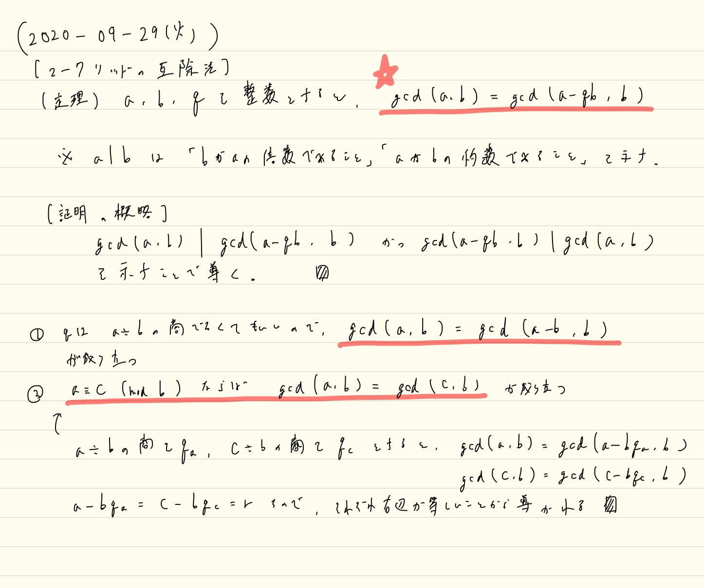
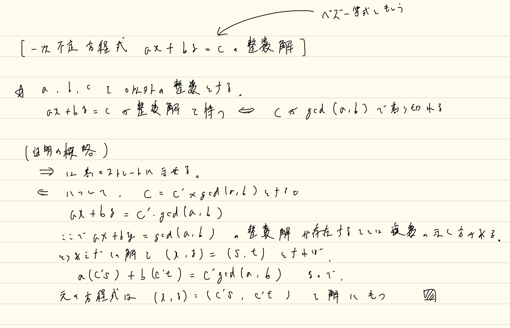
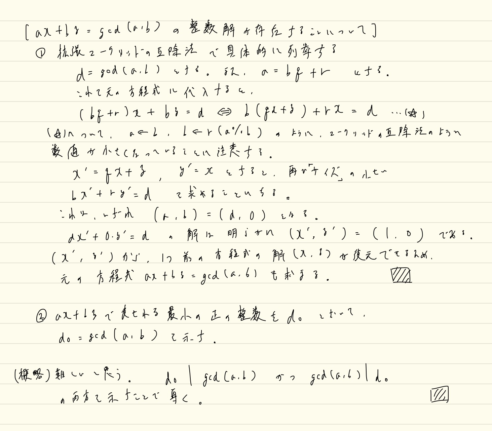
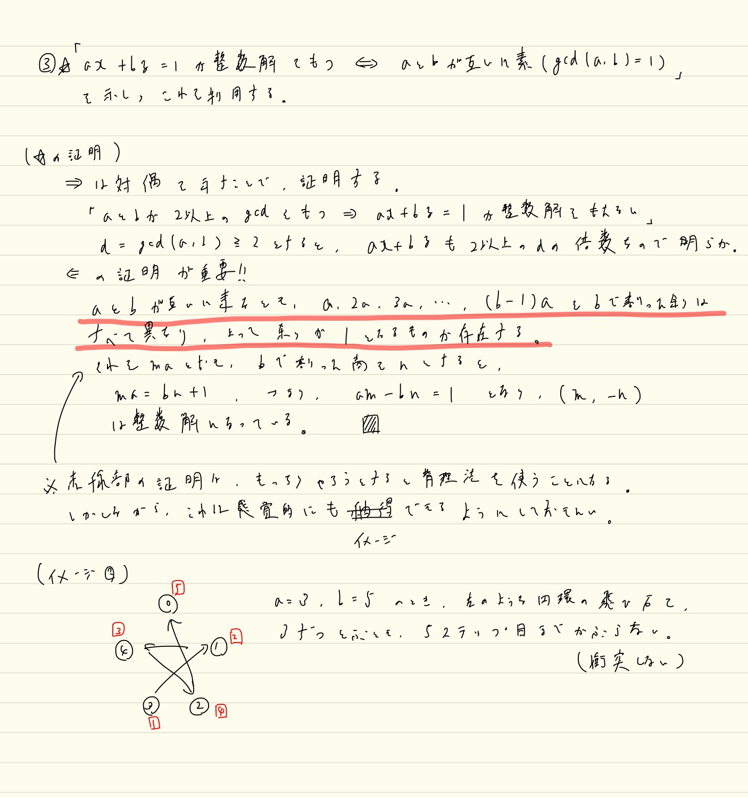
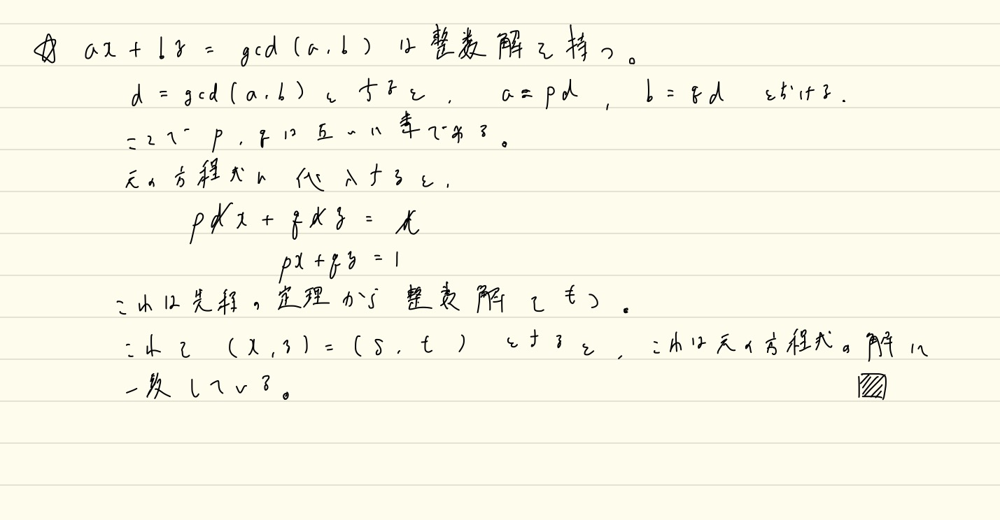

# 整数論

Last Change: 2020-10-01 00:54:42.

## ユークリッドの互除法

### ユークリッドの互除法周りで覚えるべきこと

以下の3つを覚えてしまう。

1. `gcd(a, b) = gcd(a - q * b, b)`
2. `gcd(a, b) = gcd(a-b, b)`
3. `a = c (mod b) => gcd(a, b) == gcd(c, b)`

1はユークリッドの互除法の本質そのもの。
問題のサイズが小さくできる。
概略としては `gcd(a, b) | gcd(a - q * b, b) && gcd(a - q * b, b) | gcd(a, b)` を示すことで導かれる。

2は1の `q = 1` の特殊ケース。

3はつまりは `a, c` の `b` で割ったときのあまりが等しいので、
互除法のアルゴリズムの最初のステップで同じ問題に帰着することから自然とわかる。

### 一次不定方程式（ベズー等式）の整数解を持つための必要十分条件

`a*x + b*y = c (a, b, c != 0)` が整数解を持つ `<=>` `c` が `gcd(a, b)` の倍数

`=>` はかんたんに示せるが、 `<=` は `a*x + b*y = gcd(a, b)` は整数解を持つことを示しておく必要がある。
これは、複数の示し方があるものの、いずれもテクニックが必要。

#### `a*x + b*y = gcd(a, b)` は整数解を持つことの証明

ちょっとむずかしいが、これが頭に入っていると競技のnumber theory系の問題に取り組みやすくなるので、
ぜひとも理解して覚えておきたい。

1. 拡張ユークリッドの互除法で具体的な解を導く
2. `a*x + b*y` で表される最小の正の整数を `d0` とおいて `d0 == gcd(a, b)` を示す
3. `a*x + b*y = 1` が整数解を持つ `<=>` `a, b` が互いに素: これを示し、利用する。

##### 1つ目の方法

拡張ユークリッドの互除法も、問題のサイズが小さくなる過程を理解することが重要。

`d = gcd(a, b), a = b*q + r` とする。
これらを元の方程式に代入すると、
`(b * q + r)*x + b*y = d <=> b*(q * x + y) + r*x = d`
から、 `(a, b) => (b, r)` のように、問題のサイズが小さくなっていることがわかる。

##### 2つ目の方法

難しい。
`d0 | gcd(a, b) && gcd(a, b) | d0` を導く。

##### 3つ目の方法

[高校数学の美しい物語](https://mathtrain.jp/axbyc)で説明されている。

`=>` は対偶がかんたんに示せるので、それを利用する。

`<=` が大事。
**`a, b` が互いに素なとき、 `a, 2a, 3a, ..., (b-1)a` を `b` で割ったあまりは全て異なるため、あまりが `1` となるものが存在する。**
よって `m*a = b*n + 1` と表され、ここから自然と導かれる。

※太線部分は背理法でかんたんに示せる。

※太線部分は「片方 `a` の整数倍を小さい方から列挙し、もう片方 `b` でそれらのあまりをとって並べると、
`b` 個あるあまりの種類が `b` 個並べられるまで衝突しない」というように、視覚的（？）に頭に思い描けると良い、かもしれない。。

※3つ目の命題が示せた後は、 `a = p*d, b = q*d (gcd(p, q) == 1)` とおくと、
もとの示したい命題はかんたんに示せる。

## 手書きメモ

