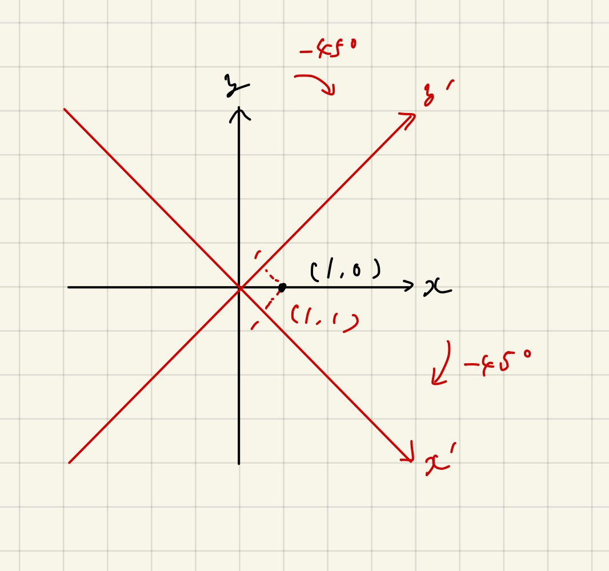
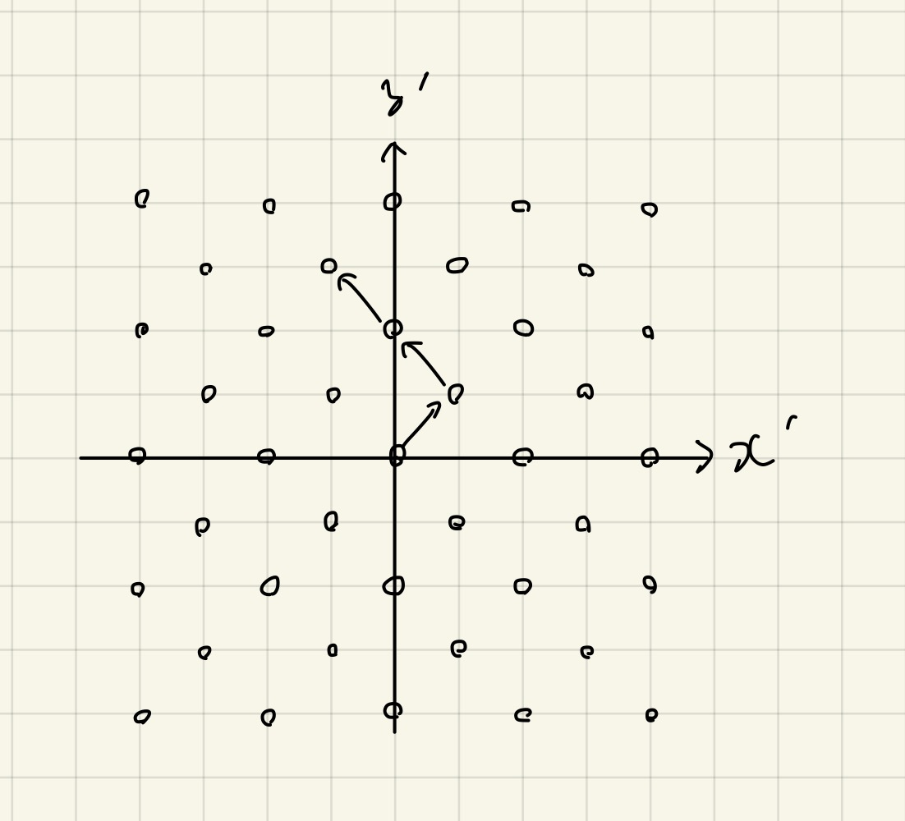
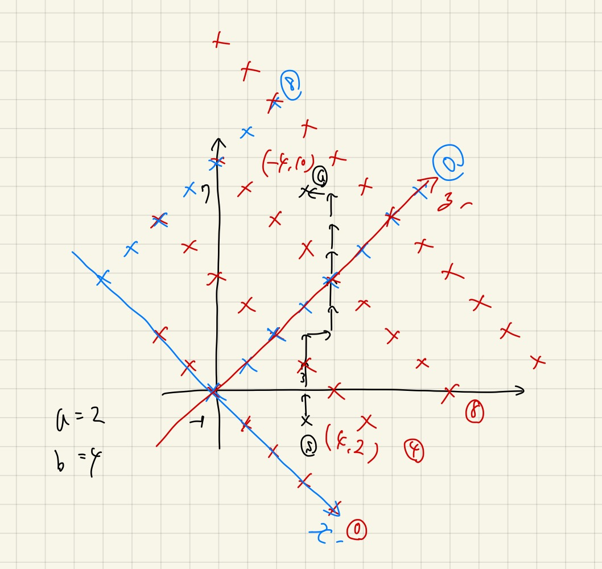

# 45度回転、マンハッタン距離

Last Change: 2020-12-12 02:43:27.

45度回転の考え方を身につける。  
また、マンハッタン距離が絡んでくることが多いので、そちらも一緒に学習する。

## 参考

- [最近の45度回転事情](https://kagamiz.hatenablog.com/entry/2014/12/21/213931)
  - 有名なまとめ記事という感じだが、ちょっと内容が高度な印象。
- [競技プログラミングにおけるマンハッタン距離問題まとめ](https://www.hamayanhamayan.com/entry/2017/10/03/165802)
  - おなじみはまやんさんのトピックまとめ記事。
  - やはり問題は簡単ではないが、AtCoderの問題が多くとっつきやすい。

## 基本

`(x, y) -> (x-y, x+y)` とする操作は、「45度回転」と呼ばれる。

これは、回転行列が `[[cos(45), -sin(45)], [sin(45), cos(45)]]` のとき、
`(x, y)` が `((x-y)/sqrt(2), (x+y)/sqrt(2))` に移動することから来ている。  
基本的に、移動後の座標系 `(x', y')` で誤った操作をしない限り（？）、この `sqrt(2)` は忘れてしまって良い。

別の見方として、点の方を45度回転（＋ルート2倍拡大）を考えるのではなく、
**`x, y` 軸をそれぞれ-45度回転させる** という見方もできる。  
こう考えると、座標が勝手に新たな軸 `x', y'` 軸に対して、もとの点が変換後の位置に来ることになる。



- もとの座標系で軸に沿った4方向の移動は、変換後の座標では斜め4方向に対応する。
- 座標のパリティ `x1+y1` が異なる座標には移動できない。
- **変換後の座標では `max(abs(x'1-x'2), abs(y'1-y'2))` によって元の座標のマンハッタン距離が求まる。**
  - **変換後の座標系の「チェビシェフ距離」で、もとの座標系のマンハッタン距離が求まる、とも表現できる。**
    - [ユークリッド距離・マンハッタン距離・チェビシェフ距離・マハラノビス距離](https://datachemeng.com/use_of_distance/)

※パリティについては、以下の画像のイメージを持っておくといいかもしれない。



## [ABC184 C.Super Ryuma](https://atcoder.jp/contests/abc184/tasks/abc184_c)

この問題は色々な視点で問題を観たくなるので、非常に良い問題だと思った（ABC-Cにしては難しすぎるけど）。

問題の難しい部分はマンハッタン距離の扱いにあり、またこれは45度回転後の座標系でのマンハッタン距離の求め方が
頭に入っているとやりやすくなる。

## [Codeforces Beta Round 92 div1 B.Squares](https://codeforces.com/contest/123/problem/B)

とりあえず自分はsquareを格子点で考えた。  
まずはbad squaresにあたる格子点を図示してみるのが良さそう。



すると45度回転したほうが見通しが良くなる。

今回のbad squaresの分布的に、「少なくとも青の格子点か赤の格子点でスタートからゴールの座標までで多く存在する方」
はまたぐ必要がある。  
基本的には、小数部分切り捨ての除算でこれらの個数は数えられるが、
それぞれ `0` をまたぐときはプラス1個されるので注意が必要。

## [CODE FESTIVAL 2017 qual A D.Four Coloring](https://atcoder.jp/contests/code-festival-2017-quala/tasks/code_festival_2017_quala_d)

いきなりグッと難しくなるが、これも45度回転で見通しが良くなる。

45度回転後の世界で、区画を `d * d` の正方形領域に分割する。  
すると、ある正方形領域からすると、その中の格子点から `d` 離れたところは、
もとの正方形領域を飛び出した、8近傍の正方形領域のいずれかに属する格子点に該当する。  
これらの格子点と色が異なるための正方形領域の塗り方は、以下のようにすれば良い。

```
RYRYRY
GBGBGB
RYRYRY
GBGBGB
```

実装も難しかったが、剰余や45度回転の変換を駆使して賢く実装する。

## [ARC047 B.同一円周上](https://atcoder.jp/contests/arc047/tasks/arc047_b)

これも最初から45度回転後の世界を考えるのが良い。

この問題は、 `N` 点の格子点の全ペアについて、最大のマンハッタン距離は各軸独立にチェビシェフ距離を考えれば良い、
というところが最大のポイント。  
それぞれの軸について端々の情報がわかると、答えの候補がたかだか4つに絞られるので、
その後は適合するものを全探索して調べれば良い。

