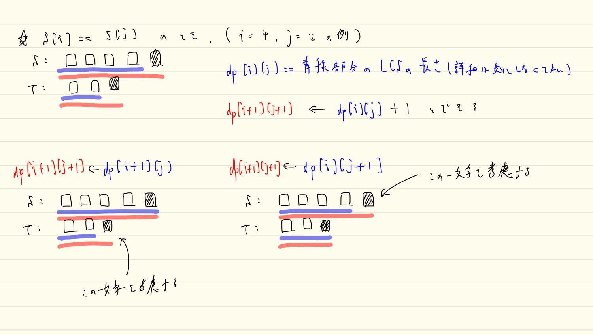

# F. LCS

問題文の通りLCS、ただし一例を復元することを求められる。

LCSは[けんちょんさんのQiita記事](https://qiita.com/drken/items/a5e6fe22863b7992efdb#%E5%95%8F%E9%A1%8C-8%E6%9C%80%E9%95%B7%E5%85%B1%E9%80%9A%E9%83%A8%E5%88%86%E5%88%97-lcs-%E5%95%8F%E9%A1%8C)
にて、「貰うDP」の形で紹介されている。

自分は「配るDP」のほうが理解しやすいことが多いので、LCSも配るDPのように考えたが、
以下のようなアルゴリズムはWAとなってしまった。

```go
	for i := 0; i < len(S); i++ {
		for j := 0; j < len(T); j++ {
			if S[i] == T[j] {
				ChMax(&dp[i+1][j+1], dp[i][j]+1)
			}
			ChMax(&dp[i+1][j], dp[i][j])
			ChMax(&dp[i][j+1], dp[i][j])
		}
	}
```

**よって、定石通り「貰うDP」で理解してしまうことが大事！**

DPは状態の定義が同じでも色々な遷移方法が考えられる場合もあるだろうが、
やはり理解しやすいものを選択するのが大事。



一例を画像にしたが、やはり理解しにくいのは、
`dp[i+1][j+1] <- dp[i+1][j]` および `dp[i+1][j+1] <- dp[i][j+1]`
の部分。
ここで毎回混乱してしまう。

ここで正しいコードを見てみる。

```go
			if S[i] == T[j] {
				ChMax(&dp[i+1][j+1], dp[i][j]+1)
			}
			ChMax(&dp[i+1][j+1], dp[i+1][j])
			ChMax(&dp[i+1][j+1], dp[i][j+1])
```

ここで、DPであるために注目中の先頭の文字以外の考慮は終わっていることに注意（余計なことを考えてはいけない）。

よって、 `S[i] != T[j]` のときは、片方のみ伸ばすことに一切意味はないことがわかる。

一方で、 `S[i] == T[j]` のときは、一見、青色の部分のLCS次第ではそれまでの `dp[i+1][j]` 等にプラス1する
必要があるようにも思えるが、
**よくよく考えるとこれは `dp[i+1][j+1] <- dp[i][j]+1` にほかならない！**
つまり、この考えは杞憂となる。

結局、自分が強く意識すべきところは、
**LCSの計算の大部分は `dp[i+1][j+1] <- dp[i][j]+1` が担ってくれている** ということ。
他の遷移は `S[i] != T[j]` のときの **伝搬役** のようなイメージ。

## 復元パートについて

以下のように、末尾の文字の等しさに注意しながらやっても大丈夫っぽいが、
難しいのでこれはスニペットにしたものを参考にしたい。。

```go
		// これでも一応通る
		if dp[si][ti] == dp[si-1][ti-1]+1 && S[si-1] == T[ti-1] {
			revRes = append(revRes, S[si-1])
			si--
			ti--
		} else if dp[si][ti] == dp[si][ti-1] {
			ti--
		} else {
			si--
		}
```


